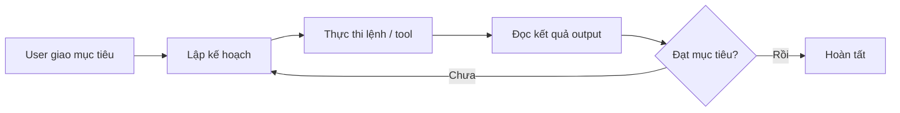

---
tags:
  - ai
  - agent
aliases:
  - Agent
  - AI Agent
---

# AI Agent

**AI Agent** (đại lý AI) là phần mềm có khả năng tương tác trực tiếp với môi trường xung quanh và tự thực hiện chuỗi hành động để hoàn thành một mục tiêu được giao — khác với chatbot chỉ trả lời một chiều.

## Cơ chế hoạt động

- Lõi là một LLM chạy theo **vòng lặp (loop)**: quan sát môi trường → lập kế hoạch → thực thi → đánh giá kết quả → lặp lại cho đến khi hoàn tất mục tiêu.
- Được trang bị quyền truy cập **tools/APIs** bên ngoài, và có thể phối hợp với các AI Agent khác để đạt mục tiêu phức tạp hơn.

## Khác biệt với chatbot thông thường

| | Chatbot | AI Agent |
|---|---|---|
| Luồng xử lý | Một chiều: hỏi → trả lời văn bản, dừng lại | Vòng lặp tự chủ, tự lặp đến khi xong việc |
| Tương tác môi trường | Không | Có (file, terminal, API, web...) |
| Tự điều chỉnh | Không | Có, dựa trên kết quả thực thi từng bước |

## Ví dụ minh họa: Claude Code

[[Claude Code]] là một AI Agent lập trình, thể hiện rõ 4 khả năng thực thi lặp:

- **Đọc & hiểu codebase** — truy vết luồng dữ liệu, giải thích tính năng, tìm nguyên nhân gốc rễ của bug xuyên suốt nhiều file.
- **Chỉnh sửa file toàn dự án** — khi refactor một hàm, tự cập nhật mọi file khác có tham chiếu đến hàm đó.
- **Tự chạy lệnh terminal** — build, test, cài thư viện, rồi **đọc output để tự điều chỉnh hành động tiếp theo** nếu có lỗi.
- **Tra cứu web** — tự tìm tài liệu mới nhất hoặc API reference khi gặp công nghệ chưa biết.

## Liên kết

- Ví dụ thực tế: [[Claude Code]]
