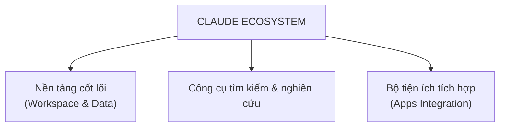

---
tags:
  - claude
  - ai
  - ecosystem
  - moc
aliases:
  - Hệ sinh thái Claude
---

# Claude Ecosystem

Ghi chú tổng (MOC — Map of Content) cho hệ sinh thái Claude. Chi tiết từng mục nằm trong các ghi chú riêng ở thư mục [[Claude Ecosystem]] để dễ đọc và mở rộng dần.

## Sơ đồ gốc

*Sơ đồ chi tiết từng nhóm nằm trong note tương ứng: [[Nền tảng cốt lõi]], [[Công cụ tìm kiếm & nghiên cứu]], [[Bộ tiện ích tích hợp]].*

## Ba nhóm chính

- [[Nền tảng cốt lõi]] (Workspace & Data)
- [[Công cụ tìm kiếm & nghiên cứu]]
- [[Bộ tiện ích tích hợp]] (Apps Integration)

## Liên kết

- Xem thêm về kỹ năng sử dụng: [[Sử dụng Claude hiệu quả]]
