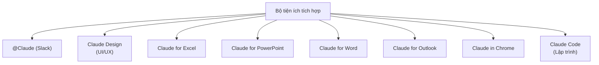

---
tags:
  - claude/nhom
aliases:
  - Bộ tiện ích tích hợp
  - Apps Integration
up: "[[Claude Ecosystem]]"
---

# Bộ tiện ích tích hợp (Apps Integration)

Nhóm các tiện ích tích hợp Claude vào các ứng dụng khác mà người dùng đã dùng sẵn.

- [[Claude for Slack]] — @Claude
- [[Claude Design]] — UI/UX
- [[Claude for Excel]]
- [[Claude for PowerPoint]]
- [[Claude for Word]]
- [[Claude for Outlook]]
- [[Claude in Chrome]]
- [[Claude Code]] — Lập trình

## Liên kết

- Thuộc: [[Claude Ecosystem]]
