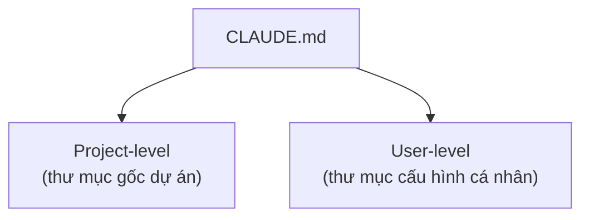

---
tags:
  - claude/tich-hop
aliases:
  - CLAUDE.md
  - Bộ nhớ dự án
up: "[[Claude Code]]"
---

# CLAUDE.md — Bộ nhớ dự án (Persistent Memory)

File Markdown đặt ở **thư mục gốc (root)** của dự án, đóng vai trò bộ nhớ dài hạn cho [[Claude Code]] — tương tự một tài liệu bàn giao/hướng dẫn hội nhập (onboarding script) dành riêng cho AI khi bước vào dự án.

## Vấn đề khi không có CLAUDE.md

- **Mất bối cảnh mỗi phiên mới** — mỗi lần mở phiên làm việc mới (hoặc sau `/clear`), Claude bắt đầu từ con số 0, không còn ký ức về quy ước dự án trước đó.
- **Tốn context window** — phải tự khám phá lại cấu trúc dự án, dependencies, tính năng nào đã triển khai — xem [[Claude Code#Hai trụ cột kỹ thuật Context Tools|Context]].
- **Dễ đưa giả định sai** — chưa hiểu quy chuẩn dự án nên có thể đoán sai, khiến người dùng mất công điều hướng lại.

## Cơ chế hoạt động

- Claude Code **tự động đọc** file này vào đầu mỗi phiên làm việc, nội dung được đính kèm sẵn vào bối cảnh (prompt context) — không cần người dùng nhắc lại thủ công.
- Ký ức được duy trì **xuyên suốt mọi phiên**, kể cả sau khi `/clear` xóa sạch lịch sử hội thoại hiện tại.

## Nội dung nên ghi vào CLAUDE.md

- Quy ước cấu trúc dự án, coding convention, chuẩn commit message.
- Kinh nghiệm xử lý lỗi lặp lại — nếu Claude liên tục mắc cùng một lỗi hoặc quên quy tắc dự án, yêu cầu Claude ghi giải pháp vào đây để các phiên sau không lặp lại.
- Danh sách kênh/cấu hình cần dùng khi tích hợp thêm công cụ khác (vd: kênh Slack cần thông báo khi dùng chung với [[Connectors (MCP)|Slack MCP Server]]).

## Cấu trúc file mẫu

Một file `CLAUDE.md` chuẩn thường chia thành 3 phần ngắn gọn:

- **`# Project`** — công nghệ cốt lõi đang dùng (vd: Next.js 15 App Router, Tailwind CSS, Drizzle ORM).
- **`# Commands`** — lệnh terminal chính xác để chạy dự án (vd: `pnpm dev`, `pnpm test`, `pnpm lint`).
- **`# Code Style`** — quy tắc kiến trúc & định dạng code của team (vd: thụt lề 2 khoảng trắng, ưu tiên named export, gom API routes vào `app/api/`, ưu tiên Server Actions).

> [!example] Tác dụng thực tế
> Với prompt đơn giản *"Tạo component hiển thị danh sách sản phẩm"*, Claude tự động áp dụng đúng Tailwind CSS, 2-space indentation, named export, và Server Actions/Drizzle ORM theo đúng khai báo — không cần giải thích lại quy chuẩn kỹ thuật ở mỗi phiên.

## Mẹo viết CLAUDE.md hiệu quả

- **Ngắn gọn** — chỉ ghi thông tin quan trọng nhất mà Claude cần tuân thủ, tránh dài dòng.
- **Dùng heading & bullet Markdown** (`#`, `##`, `-`) — giúp Claude dễ trích xuất đúng phần cần dùng thay vì đọc nguyên khối văn bản.
- **Cập nhật thường xuyên** — mỗi khi dự án đổi quy chuẩn hoặc thêm thư viện mới, cập nhật ngay để tránh Claude áp dụng quy tắc lỗi thời.

## Phân cấp bộ nhớ (Memory Hierarchy)

Claude Code phân biệt 2 cấp `CLAUDE.md` theo đối tượng sử dụng:

- **Project-level** — nằm ở root repo, commit vào Git, áp dụng cho cả team: tech stack, quy chuẩn code chung, lệnh build/test.
- **User-level** — nằm ở thư mục cấu hình cá nhân (`~/.claude/CLAUDE.md` hoặc `%USERPROFILE%\.claude\CLAUDE.md`), **không** commit lên Git, áp dụng cho **mọi dự án** mở trên máy: thói quen cá nhân (văn phong commit message, phím tắt ưa thích, thiết lập môi trường riêng).

| Tiêu chí | Project-level | User-level |
| --- | --- | --- |
| Vị trí | Root directory của repo | Thư mục Home/Config cá nhân |
| Chia sẻ Git | Có | Không |
| Phạm vi | Dự án hiện tại | Mọi dự án trên máy |
| Mục đích | Quy chuẩn team & kiến trúc app | Cấu hình & thói quen cá nhân |

## Dùng cho làm việc nhóm (Teams)

- **Check-in vào version control** — đưa `CLAUDE.md` cấp dự án vào Git/SVN cùng mã nguồn, thay vì chỉ lưu cục bộ.
- **Lợi ích** — cả team chia sẻ chung một chuẩn, Claude Code áp dụng đồng nhất quy tắc viết code, cấu trúc thư mục và quy trình làm việc cho mọi thành viên, không lệch giữa người này với người khác.

## So sánh có/không dùng CLAUDE.md

| Khi KHÔNG dùng CLAUDE.md | Khi DÙNG CLAUDE.md |
| --- | --- |
| Mất bối cảnh mỗi khi `/clear` hoặc mở phiên mới | Ký ức dự án duy trì liên tục qua mọi phiên |
| Phải liên tục nhắc lại quy tắc code, cấu trúc thư mục | Claude tự tuân thủ quy chuẩn đã khai báo từ đầu |
| Tốn context để Claude tự quét lại code | Tiết kiệm context, đi thẳng vào tác vụ chính |

## Best Practices

- **Lưu câu sửa lỗi vào bộ nhớ** — nếu phải nhắc lại cùng một quy tắc nhiều lần (vd: "Luôn dùng Server Actions thay vì API routes"), yêu cầu Claude ghi thẳng vào `CLAUDE.md`; phiên sau Claude tự tuân thủ, không cần nhắc lại.
- **Tham chiếu tài liệu dự án bằng `@`** — liên kết nhanh các file tài liệu có sẵn bằng cú pháp `@đường-dẫn-file` (vd: `@README.md`, `@docs/architecture.md`); Claude tự trích xuất ngữ cảnh từ các file này khi cần, không phải chép lại nội dung vào `CLAUDE.md`.
- **Không bắt buộc viết trước khi bắt đầu dự án** — có thể chạy dự án vài lần chưa có `CLAUDE.md`, quan sát xem hay phải sửa Claude ở điểm nào, rồi mới viết — giúp file luôn gọn, chỉ chứa thông tin thực sự cần thiết thay vì đoán trước dài dòng. Khi sẵn sàng, gõ `/init` để Claude tự quét dự án và khởi tạo khung `CLAUDE.md`.

> [!tip] Thứ tự khai báo gợi ý
> Bắt đầu đơn giản: **Tech Stack → Quy chuẩn Code → Commands cơ bản**, sau đó bổ sung dần kinh nghiệm thực tế phát sinh trong quá trình phát triển.

## Liên kết

- Thuộc: [[Claude Code]]
- Dùng trong bước: [[Explore, Plan, Code, Commit#3. Code (Viết mã)|Explore, Plan, Code, Commit — bước Code]]
- Liên quan: [[Claude Code#Auto-Compaction — khi context đầy|Auto-Compaction]]
