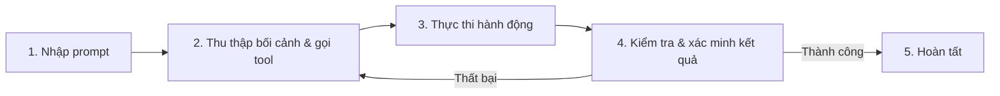

---
tags:
  - claude/tich-hop
aliases:
  - Claude Code
up: "[[Bộ tiện ích tích hợp]]"
---

# Claude Code

Claude chạy dưới dạng CLI/agent lập trình — làm việc trực tiếp trong terminal, IDE (VS Code, JetBrains) hoặc app Desktop/Web, hỗ trợ đọc/sửa code, chạy lệnh, quản lý git...

## Trường hợp sử dụng chính

- **Lập trình theo agent** — đọc hiểu codebase, sửa lỗi, viết tính năng mới, chạy test.
- **Thao tác hệ thống** — chạy shell command, quản lý git (commit, PR...) khi được cho phép.
- **Tích hợp IDE** — dùng như extension trong VS Code/JetBrains, tham chiếu trực tiếp file đang mở trong editor.

## So với Claude.ai thông thường

- **Cách làm việc** — tự động truy cập trực tiếp file, thư mục, terminal trên máy, không cần copy/paste code qua lại.
- **Vai trò** — như đồng nghiệp lập trình ([[AI Agent]]) tự thực thi tác vụ, khác với vai trò tư vấn/giải thích của chat thông thường.
- **Phạm vi** — thao tác trên toàn bộ mã nguồn dự án, không giới hạn ở nội dung dán vào khung chat hoặc tải lên Projects.

## Cơ chế hoạt động: Vòng lặp Agentic

Claude Code không phải hỏi–đáp một lượt như chatbot, mà chạy theo vòng lặp phản hồi liên tục (cụ thể hóa vòng lặp chung của [[AI Agent]]) cho đến khi xác minh được mục tiêu đã hoàn thành:

- **Tự sửa lỗi (self-correction)** — khi lệnh/test báo lỗi, Claude tự đọc error stack trace và quay lại đầu vòng lặp để thử phương án khác, không dừng lại chờ người dùng báo lỗi như chatbot thường.
- **Xác minh trước khi bàn giao (verifiable execution)** — không chỉ đoán là đã đúng mà thực sự chạy thử (test, build, đọc output) để chứng minh trước khi báo hoàn thành.
- **Human-in-the-loop** — người dùng có thể chèn thêm bối cảnh hoặc bẻ lái hướng xử lý tại bất kỳ bước nào trong vòng lặp, không chỉ ở đầu/cuối.

## Hai trụ cột kỹ thuật: Context & Tools

Hai thành tố kỹ thuật làm nền cho vòng lặp Agentic ở trên, giúp Claude Code không chỉ "nói chuyện" mà thực sự hành động:

- **Context (bộ nhớ phiên làm việc)** — chứa lịch sử hội thoại, nội dung file đã đọc, output lệnh terminal... Khi dữ liệu gần chạm giới hạn, Claude Code tự động **nén (compaction)**: tóm tắt/loại bỏ phần ít quan trọng, giữ lại chi tiết cốt lõi để không mất mạch việc đang làm dở.
- **Tools (năng lực hành động)** — khác chatbot thông thường chỉ *text-in, text-out*, Claude Code gọi tool để hành động trực tiếp: đọc/ghi file, chạy lệnh, tìm kiếm web, tra cứu mã nguồn... Claude tự hiểu ngữ nghĩa mục tiêu để quyết định **khi nào** gọi tool nào và **dùng kết quả trả về** ra sao cho bước kế tiếp, không theo kịch bản cứng nhắc.

## Nguyên tắc dùng hiệu quả

- **Context window có giới hạn** — không nạp toàn bộ codebase cùng lúc; hoạt động theo kiểu agent, tự truy vết/tra cứu đúng file, đúng hàm cần thiết thay vì đọc tràn lan.
- **Luôn xin phép trước khi hành động** — mặc định hỏi ý kiến trước khi chạy lệnh terminal hoặc ghi đè file; người dùng luôn kiểm soát, có thể chọn giám sát chặt từng thao tác hoặc duyệt nhanh.
- **Vẫn có thể mắc sai sót** — hiểu sai ý định, tạo bug mới, hoặc đưa ra giải pháp quá phức tạp (over-engineer); cần người dùng tiếp tục tham gia rà soát, định hướng lại kịp thời (stay in the loop).

## Cơ chế phân quyền (Permissions)

Quyết định mức độ tự chủ của Claude Code và mức độ giám sát của người dùng, gồm 3 chế độ:

- **Default** — xin phép trước mọi lần sửa file hoặc chạy lệnh terminal; an toàn tối đa, duyệt từng thao tác.
- **Auto-accept edits** — tự do sửa file không cần hỏi, nhưng lệnh shell/terminal vẫn phải được duyệt; tăng tốc code/refactor mà vẫn chặn lệnh nguy hiểm.
- **Plan mode** — chỉ dùng tool read-only để khảo sát, lập kế hoạch chi tiết trước, người dùng duyệt kế hoạch rồi mới cho phép chỉnh sửa; phù hợp tác vụ lớn/phức tạp.

Có thể cấu hình các chế độ này trong `settings file` của Claude Code.

> [!warning] Rủi ro khi tắt permissions
> Cho Claude Code toàn quyền chạy lệnh terminal mà không giám sát có thể gây sai sót khó đảo ngược: xóa nhầm dữ liệu, chạy nhầm lệnh build, cài đè gói thư viện...

## Liên kết

- Thuộc nhóm: [[Bộ tiện ích tích hợp]]
- Khái niệm nền: [[AI Agent]]
- Xem thêm: [[Claude for Slack]], [[Claude Design]], [[Claude in Chrome]]
