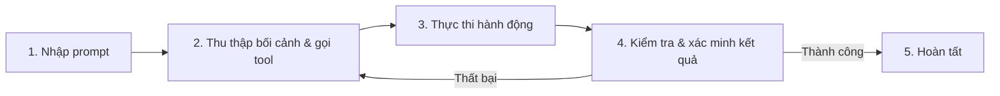

---
tags:
  - claude/tich-hop
aliases:
  - Claude Code
up: "[[Bộ tiện ích tích hợp]]"
---

# Claude Code

Claude chạy dưới dạng CLI/agent lập trình — làm việc trực tiếp trong terminal, IDE (VS Code, JetBrains) hoặc app Desktop/Web, hỗ trợ đọc/sửa code, chạy lệnh, quản lý git...

## Trường hợp sử dụng chính

- **Lập trình theo agent** — đọc hiểu codebase, sửa lỗi, viết tính năng mới, chạy test.
- **Thao tác hệ thống** — chạy shell command, quản lý git (commit, PR...) khi được cho phép.
- **Tích hợp IDE** — dùng như extension trong VS Code/JetBrains, tham chiếu trực tiếp file đang mở trong editor.

## So với Claude.ai thông thường

- **Cách làm việc** — tự động truy cập trực tiếp file, thư mục, terminal trên máy, không cần copy/paste code qua lại.
- **Vai trò** — như đồng nghiệp lập trình ([[AI Agent]]) tự thực thi tác vụ, khác với vai trò tư vấn/giải thích của chat thông thường.
- **Phạm vi** — thao tác trên toàn bộ mã nguồn dự án, không giới hạn ở nội dung dán vào khung chat hoặc tải lên Projects.

## Cơ chế hoạt động: Vòng lặp Agentic

Claude Code không phải hỏi–đáp một lượt như chatbot, mà chạy theo vòng lặp phản hồi liên tục (cụ thể hóa vòng lặp chung của [[AI Agent]]) cho đến khi xác minh được mục tiêu đã hoàn thành:

- **Tự sửa lỗi (self-correction)** — khi lệnh/test báo lỗi, Claude tự đọc error stack trace và quay lại đầu vòng lặp để thử phương án khác, không dừng lại chờ người dùng báo lỗi như chatbot thường.
- **Xác minh trước khi bàn giao (verifiable execution)** — không chỉ đoán là đã đúng mà thực sự chạy thử (test, build, đọc output) để chứng minh trước khi báo hoàn thành.
- **Human-in-the-loop** — người dùng có thể chèn thêm bối cảnh hoặc bẻ lái hướng xử lý tại bất kỳ bước nào trong vòng lặp, không chỉ ở đầu/cuối.

## Hai trụ cột kỹ thuật: Context & Tools

Hai thành tố kỹ thuật làm nền cho vòng lặp Agentic ở trên, giúp Claude Code không chỉ "nói chuyện" mà thực sự hành động:

- **Context (bộ nhớ phiên làm việc)** — chứa lịch sử hội thoại, nội dung file đã đọc, output lệnh terminal... Khi dữ liệu gần chạm giới hạn, Claude Code tự động **nén (compaction)**: tóm tắt/loại bỏ phần ít quan trọng, giữ lại chi tiết cốt lõi để không mất mạch việc đang làm dở.
- **Tools (năng lực hành động)** — khác chatbot thông thường chỉ *text-in, text-out*, Claude Code gọi tool để hành động trực tiếp: đọc/ghi file, chạy lệnh, tìm kiếm web, tra cứu mã nguồn... Claude tự hiểu ngữ nghĩa mục tiêu để quyết định **khi nào** gọi tool nào và **dùng kết quả trả về** ra sao cho bước kế tiếp, không theo kịch bản cứng nhắc.

## Nguyên tắc dùng hiệu quả

- **Context window có giới hạn** — không nạp toàn bộ codebase cùng lúc; hoạt động theo kiểu agent, tự truy vết/tra cứu đúng file, đúng hàm cần thiết thay vì đọc tràn lan.
- **Luôn xin phép trước khi hành động** — mặc định hỏi ý kiến trước khi chạy lệnh terminal hoặc ghi đè file; người dùng luôn kiểm soát, có thể chọn giám sát chặt từng thao tác hoặc duyệt nhanh.
- **Vẫn có thể mắc sai sót** — hiểu sai ý định, tạo bug mới, hoặc đưa ra giải pháp quá phức tạp (over-engineer); cần người dùng tiếp tục tham gia rà soát, định hướng lại kịp thời (stay in the loop).

## Cơ chế phân quyền (Permissions)

Quyết định mức độ tự chủ của Claude Code và mức độ giám sát của người dùng, gồm 3 chế độ:

- **Default** — xin phép trước mọi lần sửa file hoặc chạy lệnh terminal; an toàn tối đa, duyệt từng thao tác.
- **Auto-accept edits** — tự do sửa file không cần hỏi, nhưng lệnh shell/terminal vẫn phải được duyệt; tăng tốc code/refactor mà vẫn chặn lệnh nguy hiểm.
- **[[Plan Mode]]** — chỉ dùng tool read-only để khảo sát, lập kế hoạch chi tiết trước, người dùng duyệt kế hoạch rồi mới cho phép chỉnh sửa; phù hợp tác vụ lớn/phức tạp.

Có thể cấu hình các chế độ này trong `settings file` của Claude Code, hoặc chuyển đổi nhanh ngay trong lúc thao tác bằng phím tắt `Shift + Tab` (lặp lại để xoay vòng qua các chế độ) mà không cần sửa file cấu hình.

> [!tip] Không có chế độ đúng/sai tuyệt đối
> Chọn chế độ phù hợp với mức độ tin tưởng và sự thoải mái của bản thân khi làm việc với Claude Code trong từng tác vụ cụ thể.

<!-- -->

> [!warning] Rủi ro khi tắt permissions
> Cho Claude Code toàn quyền chạy lệnh terminal mà không giám sát có thể gây sai sót khó đảo ngược: xóa nhầm dữ liệu, chạy nhầm lệnh build, cài đè gói thư viện...

## Cài đặt & khởi chạy

- **macOS / Linux / WSL** — khuyến nghị dùng lệnh `curl` (cài nhanh, hỗ trợ tự động cập nhật); có thể thay bằng `brew install` nhưng không tự cập nhật.
- **Windows** — dùng `Invoke-RestMethod` trong PowerShell hoặc `curl` trong CMD; có thể thay bằng `winget install` nhưng cũng không tự cập nhật.
- **Khởi chạy lần đầu** — mở terminal tại đúng thư mục dự án, gõ `claude` (nếu lệnh chưa nhận, tắt/mở lại terminal). Thiết lập ban đầu gồm: chọn color theme, rồi đăng nhập tài khoản Claude (Pro/Max) hoặc nhập API key — chọn đúng tùy chọn Enterprise nếu công ty dùng gói này.

> [!warning] Phạm vi truy cập thư mục (Folder Scope)
> Claude Code có toàn quyền truy cập thư mục nơi lệnh `claude` được gõ, cùng mọi thư mục con bên trong — cần đứng đúng thư mục dự án cần xử lý trước khi khởi chạy.

### Cài đặt qua VS Code Extension

- **Cài đặt** — mở bảng Extensions (`Ctrl+Shift+X`, Mac: `Cmd+Shift+X`), tìm "Claude Code", chọn đúng tiện ích do Anthropic phát hành (có tích xanh xác thực), nhấn Install, khởi động lại VS Code nếu được yêu cầu.
- **Cách mở** — qua Command Palette (`Ctrl+Shift+P`/`Cmd+Shift+P` → "Claude Code: Open in New Tab") hoặc click icon Claude trên sidebar.
- **Chuyển đổi giao diện** — mặc định hiển thị UI đồ họa tương tự bản Terminal; có thể tắt trong Settings để quay về trải nghiệm dòng lệnh (terminal) nguyên bản.

### Cài đặt qua JetBrains IDE Plugin

- **IDE hỗ trợ** — IntelliJ IDEA, PyCharm, WebStorm, CLion... (mọi IDE nền JetBrains).
- **Cài đặt** — vào Settings → Plugins → tab Marketplace, tìm "Claude Code", nhấn Install, sau đó Restart IDE để áp dụng.
- **Cách mở** — sau khi khởi động lại, icon Claude xuất hiện trên thanh công cụ; click vào để mở pane phụ chứa giao diện terminal, hiển thị song song bên cạnh editor chính.

### Cài đặt qua Claude Desktop App

- **Kích hoạt** — sau khi cài đặt và đăng nhập Claude Desktop App, nhấn nút gạt (toggle) **"Code"** ở phía trên cùng màn hình để chuyển từ giao diện Chat sang giao diện lập trình.
- **Giao diện** — look-and-feel tương đồng giao diện Chat thông thường, dễ làm quen.
- **Tính năng riêng** — so với CLI/IDE extension, bản Desktop có thêm:
  - Chọn thư mục làm việc (working directory) cụ thể ngay trên giao diện.
  - Tùy chỉnh [[#Cơ chế phân quyền (Permissions)|Permissions]] trực quan bằng UI thay vì sửa `settings file`.
  - Hỗ trợ kết nối và làm việc trên môi trường **Cloud**, không chỉ giới hạn ở máy cục bộ.

### Truy cập qua Trình duyệt Web (claude.ai/code)

- **Cách truy cập** — vào thẳng `claude.ai/code`, hoặc nhấn mục **"Code"** trên sidebar trái của giao diện `claude.ai` thông thường.
- **Giao diện** — cách hoạt động và bố cục tương đồng bản [[#Cài đặt qua Claude Desktop App|Desktop App]].

> [!warning] Giới hạn phạm vi (chỉ GitHub Repository)
> Khác với bản Terminal/IDE (toàn quyền thao tác trên ổ đĩa máy cục bộ), bản Web chỉ hoạt động trong phạm vi các **GitHub repository** đã kết nối — không truy cập được thư mục cục bộ.

### So sánh nhanh các môi trường chạy

| Môi trường | Phạm vi mã nguồn | Cách mở/kết nối |
| --- | --- | --- |
| Terminal / VS Code / JetBrains | Thư mục cục bộ bất kỳ | Lệnh `claude` hoặc plugin IDE |
| Claude Desktop App | Thư mục cục bộ hoặc môi trường Cloud | Nút gạt "Code" trong app |
| Trình duyệt Web (`claude.ai/code`) | Chỉ GitHub repository đã kết nối | Đường dẫn `claude.ai/code` hoặc sidebar |

### Chọn môi trường theo nhu cầu sử dụng

Ngoài phạm vi mã nguồn, có thể chọn môi trường dựa trên mục đích thực tế:

| Môi trường | Phù hợp nhất khi... | Ưu điểm cốt lõi |
| --- | --- | --- |
| Terminal | Muốn trải nghiệm sớm nhất các tính năng mới | Tính năng mới luôn được cập nhật tại đây đầu tiên |
| VS Code / JetBrains | Muốn thao tác liền mạch ngay trong IDE đang code | Vừa đọc code vừa giao việc cho AI, không rời editor |
| Desktop App | Muốn ủy quyền tác vụ chạy ngầm | Treo tác vụ cho Claude tự làm ở nền trong khi làm việc khác |
| Web (`claude.ai/code`) | Cần làm việc từ xa qua GitHub repository | Không cần clone code về máy local |

> [!tip] Không có lựa chọn tuyệt đối
> Việc chọn môi trường nào phụ thuộc vào thói quen cá nhân và tính chất dự án đang triển khai.

## Liên kết

- Thuộc nhóm: [[Bộ tiện ích tích hợp]]
- Khái niệm nền: [[AI Agent]]
- Xem thêm: [[Claude for Slack]], [[Claude Design]], [[Claude in Chrome]]
