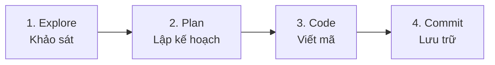

---
tags:
  - claude/tich-hop
aliases:
  - Explore, Plan, Code, Commit
  - Quy trình 4 bước
up: "[[Claude Code]]"
---

# Explore, Plan, Code, Commit

Quy trình làm việc chuẩn được khuyến nghị khi dùng [[Claude Code]] cho tác vụ phức tạp — tách rõ giai đoạn *tìm hiểu bối cảnh* và *lập kế hoạch* trước khi để Claude viết code, tránh phải sửa lỗi dây chuyền do code vội vã.

## Sơ đồ 4 bước

## 1. Explore & 2. Plan

Cách nhanh nhất để thực thi 2 bước đầu: bật [[Plan Mode]] (`Shift+Tab` cho tới khi hiện "Plan Mode").

- **Read-only** — Claude chỉ đọc file liên quan trong dự án, tra cứu web nếu cần tài liệu thư viện mới; chưa sửa gì lên mã nguồn.
- **Đầu ra** — một bản kế hoạch hành động chi tiết (plan of action) để người dùng duyệt trước khi cho phép chỉnh sửa thật.
- Nếu chỉ cần khảo sát/tóm tắt tổng quan mã nguồn mà không có ý định sửa code, có thể chạy **Explore subagent** độc lập mà không cần bật cả Plan Mode.

> Xem cơ chế hoạt động chi tiết và ví dụ thực hành ở [[Plan Mode]].

## 3. Code (Viết mã)

Sau khi duyệt xong Plan, chọn **"Approve"** để Claude lần lượt thực hiện từng hạng mục theo đúng [[Claude Code#Cơ chế hoạt động Vòng lặp Agentic|vòng lặp Agentic]]: sửa file/chạy lệnh từng bước, tự kiểm tra và xác minh kết quả (build, test) trước khi báo hoàn thành.

- **Tự xử lý sự cố** — Claude tự tìm cách khắc phục lỗi phát sinh trong lúc code, nhưng đôi khi vẫn cần người dùng can thiệp để định hướng lại.
- **Lợi ích từ Explore & Plan trước đó** — đã khảo sát kỹ nên người dùng hiểu rõ bối cảnh và lý do Claude ra từng quyết định kỹ thuật, việc chỉ dẫn ở bước Code vì vậy dễ dàng hơn.

### Mẹo giúp giai đoạn Code diễn ra mượt mà

- **Xác định tiêu chí thành công rõ ràng** ngay từ lúc lập Plan — Claude cần biết chính xác kết quả "đúng" trông như thế nào.
- **Trang bị thêm công cụ hỗ trợ** để giảm số vòng giao tiếp qua lại (ví dụ: cài Chrome extension để Claude tự mở browser tab, kiểm thử UI trực tiếp — xem [[Claude in Chrome]]).
- **Cung cấp bộ test suite** (unit/integration test) để Claude liên tục tự kiểm tra lại code; Claude cũng có thể tự viết bộ test này.

> [!tip] Tối ưu bộ nhớ với CLAUDE.md
> Nếu Claude liên tục mắc cùng một lỗi hoặc quên quy tắc dự án, yêu cầu Claude ghi giải pháp vào file `CLAUDE.md` — file này đóng vai trò bộ nhớ dài hạn, lưu quy ước cấu trúc và kinh nghiệm xử lý lỗi cho các phiên làm việc sau.

## 4. Commit (Lưu trữ)

Sau khi tự kiểm thử (self-testing) và hài lòng với kết quả, tác vụ mới sẵn sàng để commit/push:

- Để Claude tự viết commit message mô tả đúng thay đổi, theo đúng văn phong/chuẩn của dự án, thay vì tự soạn tay.
- Luôn xem lại diff trước khi xác nhận — tránh để Claude tự ý push hoặc thao tác git nguy hiểm khi chưa được cho phép.

### Review độc lập bằng Subagent

Ngay trước khi push code để tạo Pull Request, chạy một **Subagent** riêng để rà soát lại toàn bộ code vừa sửa — bước kiểm tra cuối trước khi mã nguồn được chia sẻ ra ngoài.

- **Cơ chế "góc nhìn mới" (fresh eyes)** — Subagent hoạt động trong một context window hoàn toàn độc lập với Agent chính, nên không mang theo thành kiến (bias) hay giả định lệch mà Agent chính có thể đã tích tụ trong suốt quá trình viết code trước đó.

#### Hai nguyên tắc khi thiết lập Subagent review

- **Giới hạn công cụ chỉ đọc (read-only tools)** — cấu hình cho Subagent kiểm duyệt chỉ được dùng các tool đọc (đọc file, tìm kiếm), không cấp quyền chỉnh sửa. Vai trò của reviewer là phát hiện và cảnh báo lỗi (flag issues), không tự ý sửa code.
- **Check-in cấu hình vào repo (team alignment)** — lưu file cấu hình Subagent này vào kho mã nguồn của dự án, đảm bảo mọi thành viên trong team dùng chung một tiêu chuẩn đánh giá code thống nhất, thay vì mỗi người tự cấu hình riêng.

> [!tip] Trong Claude Code
> Có thể triển khai theo nguyên tắc trên bằng cách tạo custom subagent (qua `/agents`) chỉ cấp quyền `Read`, `Grep`, `Glob`... rồi lưu file cấu hình vào thư mục `.claude/agents/` trong repo dự án.

### Tự động hóa với Skill `/commit-push-pr`

Sau khi review xong, thay vì thực hiện thủ công từng bước riêng lẻ (`git commit` → `git push` → mở web tạo PR → copy link gửi Slack), có thể gộp cả chuỗi thao tác này vào một [[Skills|Skill]] gọi bằng lệnh duy nhất `/commit-push-pr`:

- **Tự động phân tích & thực thi** — Claude tự đọc `git diff`, soạn commit message phù hợp, push branch lên remote và khởi tạo Pull Request — không cần chuyển qua lại giữa Terminal và giao diện Web GitHub/GitLab.
- **Thông báo qua Slack (tùy chọn)** — nếu đã cấu hình [[Connectors (MCP)|Slack MCP Server]] và khai báo danh sách kênh cần nhận thông báo trong `CLAUDE.md`, Claude tự gửi link PR vừa tạo vào đúng kênh Slack của team ngay sau khi PR khởi tạo thành công, để đồng nghiệp vào review sớm.

> [!tip] Vẫn cần xem lại trước khi push
> Tự động hóa 3-trong-1 không thay thế bước xem diff/duyệt commit ở trên — nên vẫn xác nhận thay đổi trước khi để Claude push/tạo PR, đặc biệt với những repo có quy tắc branch protection nghiêm ngặt.

### Tiếp tục phiên làm việc qua PR (`--from-pr`)

- **Tự động liên kết (automatic linking)** — khi Claude tạo PR (qua `gh pr create` hoặc `/commit-push-pr`), phiên làm việc hiện tại tự động được gán liền với PR đó.
- **Quay lại khi cần (resume session)** — khi PR có comment review từ đồng nghiệp hoặc CI báo lỗi build, không cần giải thích lại bối cảnh từ đầu; chỉ cần mở terminal gõ `claude --from-pr <PR_NUMBER>` (vd: `claude --from-pr 42`).
- **Lợi ích** — Claude nạp lại đúng ngữ cảnh và lịch sử của phiên làm việc trước đó, có thể bắt tay sửa lỗi/điều chỉnh code ngay lập tức.

### Tổng kết tính năng hỗ trợ Git

| Tính năng | Công dụng chính | Lợi ích cho workflow |
| --- | --- | --- |
| Subagent Code Review | Đánh giá lại mã nguồn bằng subagent read-only trước khi push | Góc nhìn khách quan, không mang thành kiến từ agent chính |
| `/commit-push-pr` | Gộp tạo commit message → push → tạo PR thành một thao tác | Tiết kiệm thời gian, tự động báo PR lên kênh Slack |
| `claude --from-pr <ID>` | Khôi phục phiên làm việc gắn liền với một PR cụ thể | Xử lý feedback review/lỗi CI mà không mất bối cảnh cũ |

## Vì sao Explore & Plan là bước quan trọng nhất

- **Định hướng đúng trước khi viết code** — đổi hướng lúc lập kế hoạch (chưa có dòng code nào) luôn nhanh và ít tốn công hơn nhiều so với sửa một đống code đã viết sai cấu trúc.
- **Quyền xem xét của người dùng** — đánh giá bản kế hoạch, yêu cầu Claude điều chỉnh trực tiếp trên đó nếu chưa ưng ý, thay vì để Claude code sai rồi mới sửa.

## Ví dụ prompt

> "Tôi cần thêm tính năng chuyển đổi định dạng WebP vào pipeline tải ảnh lên của hệ thống. Hãy tìm hiểu xem đoạn chuyển đổi này nên nằm ở đâu trong pipeline, liệu chúng ta có cần thêm thư viện phụ thuộc (dependencies) mới hay không, và đề xuất hướng tiếp cận."

## Tóm tắt chế độ/công cụ theo từng bước

| Bước | Hành động chính | Chế độ / Công cụ khuyên dùng |
| --- | --- | --- |
| 1. Explore | Đọc file, hiểu luồng dữ liệu | [[Plan Mode]] hoặc Explore subagent |
| 2. Plan | Duyệt bản kế hoạch | [[Plan Mode]] (read-only) |
| 3. Code | Sửa file, chạy lệnh, tự kiểm tra | Approval / Auto-accept Mode (`Shift+Tab`) |
| 4. Commit | Review bằng Subagent, viết commit message | Main Agent + Code Review Subagent |

## Liên kết

- Thuộc: [[Claude Code]]
- Xem thêm: [[Plan Mode]], [[Skills]], [[Connectors (MCP)]]
