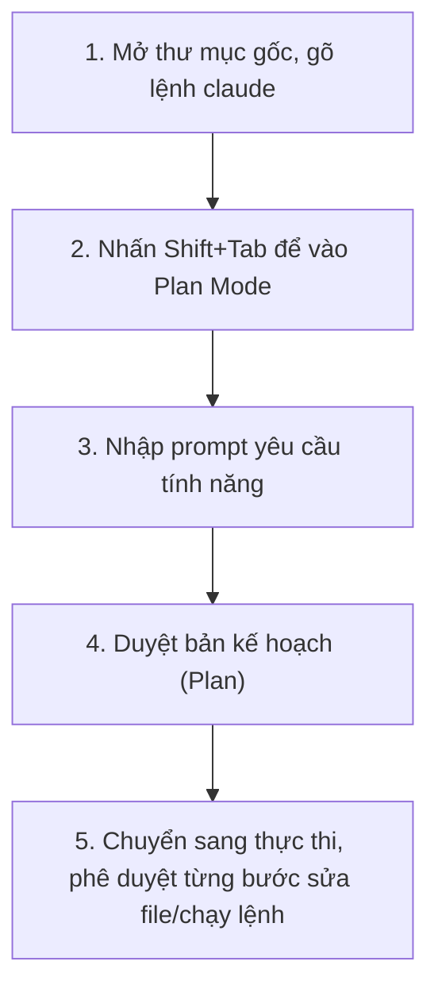

---
tags:
  - claude/tich-hop
aliases:
  - Plan Mode
  - Plan mode
up: "[[Claude Code]]"
---

# Plan Mode

Một trong 3 [[Claude Code#Cơ chế phân quyền (Permissions)|chế độ phân quyền]] của [[Claude Code]] — bắt buộc chỉ dùng tool **read-only** (đọc file, tìm kiếm) để khảo sát và lập kế hoạch trước khi được phép sửa bất kỳ thứ gì.

## Cách kích hoạt

Nhấn `Shift + Tab` vài lần trong lúc thao tác để xoay vòng qua các chế độ phân quyền cho tới khi vào Plan Mode — không cần sửa file cấu hình.

## Cơ chế hoạt động

- **Read-only** — chỉ đọc file, tìm kiếm cấu trúc mã nguồn để phân tích và nghiên cứu phương án, **chưa thực hiện bất kỳ thay đổi nào** lên codebase.
- **Hỏi lại khi mơ hồ** — nếu gặp điểm chưa rõ trong yêu cầu, Claude chủ động hỏi lại (clarifying questions) thay vì tự đoán.
- **Xuất ra kế hoạch chi tiết** — kết thúc quá trình khảo sát bằng một bản kế hoạch từng bước (step-by-step plan) để người dùng duyệt trước khi cho phép chỉnh sửa thật.

## Trường hợp phù hợp nhất

- Xây dựng tính năng phức tạp, nhiều bước (multi-step implementations).
- Rà soát mã nguồn an toàn (safe code review) mà không sợ Claude lỡ tay sửa code hiện tại.

## Ví dụ thực hành: Thêm Dark Mode Toggle

**Prompt mẫu:**

> *"Ứng dụng của tôi cần triển khai Dark Mode trên toàn bộ app. Bạn có thể tạo một nút gạt toggle ở phần header cho phép người dùng chuyển đổi giữa Light Mode và Dark Mode không? Tôi cần bạn tìm một màu tương phản tốt dựa trên giao diện sáng hiện có."*

**Kết quả thu được** — người dùng vẫn giữ toàn quyền phê duyệt (approval) tại từng bước sửa file hay chạy lệnh trong lúc thực thi; sau khi hoàn tất có thể xem lại chính xác những file đã bị sửa và tư duy (reasoning) dẫn đến kết quả cuối cùng.

## Liên kết

- Thuộc nhóm: [[Claude Code#Cơ chế phân quyền (Permissions)|Cơ chế phân quyền (Permissions)]]
