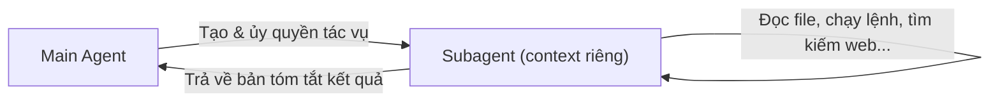

---
tags:
  - claude/tich-hop
aliases:
  - Subagents
  - Subagent
  - Tác vụ phụ
up: "[[Claude Code]]"
---

# Subagents (Tác vụ phụ)

Cơ chế trong [[Claude Code]] cho phép Agent chính (main agent) **ủy quyền** một tác vụ khảo sát/tra cứu cho một tác vụ phụ chạy trong context window **độc lập**, rồi chỉ nhận về bản tóm tắt kết quả — nhờ đó context chính luôn gọn gàng.

## Vấn đề cần giải quyết

Thao tác khảo sát như đọc nhiều file mã nguồn, chạy lệnh kiểm tra, tìm kiếm tài liệu web... tiêu tốn nhiều dung lượng [[Claude Code#Hai trụ cột kỹ thuật Context Tools|context]], nhưng phần lớn dữ liệu thô thu được không trực tiếp đóng góp vào kết quả/mã nguồn cuối cùng cần giữ lại.

## Cơ chế hoạt động

## Lợi ích cốt lõi

- **Tách biệt context window** — subagent sở hữu vùng nhớ hoàn toàn độc lập, không làm phình context của Agent chính.
- **Chạy song song (parallel)** — có thể ủy quyền nhiều subagent cùng lúc, tăng tốc độ xử lý khi công việc tách nhỏ được.
- **Context chính luôn "sạch"** — Agent chính chỉ nhận kết quả cuối, không bị dữ liệu trung gian (raw tool output) làm nhiễu.

## Trường hợp phù hợp

- Tác vụ tra cứu chỉ cần nhận kết quả cuối, không cần giữ lại chi tiết quá trình tìm (vd: "endpoint đăng nhập nằm ở đâu?").
- Khảo sát/nghiên cứu rộng trên nhiều file trước khi bắt tay implement.

## Tự tạo Subagent tùy biến

Subagent được định nghĩa dưới dạng file Markdown chứa YAML frontmatter. Cách đơn giản nhất để tạo mới là qua giao diện tương tác:

1. Gõ lệnh `/agents` trong terminal.
2. Chọn **"Create new agent"**.
3. Cấu hình từng bước:
   - **Scope** — dùng riêng cho dự án hiện tại hay dùng chung cho mọi dự án.
   - **Purpose** — mô tả mục đích, nhiệm vụ chính của agent.
   - **Tools** — danh sách công cụ agent được phép dùng (vd: chỉ đọc file, không cho sửa).
   - **Color** — màu hiển thị để phân biệt trên giao diện dòng lệnh.
4. Claude tự sinh `name`, `description`, `prompt` — trong đó `description` là căn cứ để Agent chính quyết định **khi nào tự động kích hoạt** subagent này.

### Tùy chỉnh nâng cao

- **Bộ nhớ dài hạn (persistent memory)** — subagent giữ được ký ức xuyên suốt nhiều phiên làm việc; hữu ích khi tái sử dụng liên tục trên cùng một dự án (vd: subagent chuyên kiểm tra bảo mật, chuẩn hóa giao diện).
- **Nạp sẵn Skill** — khai báo `skills` trong frontmatter kèm tên các Skill cần dùng.

> [!warning] Khác với hội thoại chính
> [[Skills]] trong hội thoại chính chỉ nạp vào context khi thực sự cần, nhưng subagent nạp **toàn bộ nội dung Skill khai báo sẵn ngay từ đầu** — cân nhắc trade-off tốn context nếu khai báo quá nhiều Skill không dùng đến.

## Liên kết

- Thuộc nhóm: [[Claude Code]]
- Áp dụng khi: [[Claude Code#Mẹo tiết kiệm context|Mẹo tiết kiệm context]]
- Xem thêm: [[Skills]]
