---
tags:
  - claude/nhom
aliases:
  - Claude Cowork
  - Cowork
up: "[[Claude Ecosystem]]"
---

# Claude Cowork

Ghi chú tổng (MOC) cho **Claude Cowork** — môi trường hợp tác (coworking environment) giúp ủy quyền công việc trực tiếp cho Claude ngay trong không gian làm việc thực tế (local, cloud app, trình duyệt), thay vì chỉ hỏi-đáp như Claude Chat. Chi tiết từng mục nằm trong các ghi chú riêng ở thư mục [[Claude Cowork]].

## Sơ đồ gốc

```mermaid
graph TD
    Root["CLAUDE COWORK"]

    Root --> A["Bản chất & Triết lý"]
    Root --> B["Chuyển dịch tư duy<br/>Chat → Cowork"]
    Root --> C["Tích hợp môi trường<br/>(4 trụ cột)"]
    Root --> D["Anatomy của Task chuẩn"]
    Root --> D5["Công thức Prompt chuẩn<br/>(Deliverable+Inputs+Nuances)"]
    Root --> D2["Tiêu chí chọn Task<br/>(3 Patterns)"]
    Root --> D3["Progress Panel<br/>(Bảng tiến độ)"]
    Root --> D4["Nhịp điệu Làm việc<br/>(Work Rhythm)"]
    Root --> D6["Cơ chế Câu hỏi<br/>Làm rõ (Clarifying)"]
    Root --> D7["Điều chỉnh Mid-task<br/>(Steer & Interrupt)"]
    Root --> D8["Nghiệm thu Sản phẩm<br/>(Review Deliverable)"]
    Root --> E["So sánh 3 chế độ<br/>Chat, Cowork, Code"]
    Root --> F["Cài đặt & Khởi chạy"]
    Root --> G["Chọn Thư mục &<br/>Phân quyền Đọc/Ghi"]
    Root --> H["Thêm & Quản lý<br/>Connectors"]
    Root --> H2["Cài đặt & Tùy biến<br/>Plugins"]
    Root --> H3["Tự xây dựng Plugin"]
    Root --> I["Mô hình Phân quyền<br/>(Permissions)"]
    Root --> J["Thực hành: Bản tóm tắt<br/>Thư mục"]
    Root --> K["Lên lịch Tác vụ<br/>(Scheduled Tasks)"]
    Root --> L["Cloud Cowork<br/>(Mobile & Web)"]
    Root --> M["Tích lũy Giá trị<br/>(Compounding Value)"]
    Root --> N["Global Instructions &<br/>Bộ nhớ theo Ngữ cảnh"]
    Root --> O["Projects trong Cowork<br/>(4 Thành phần & Bộ nhớ)"]
    Root --> P["Mô hình Áp dụng Projects<br/>(3 Use Cases)"]
    Root --> Q["Thực hành: Thiết lập<br/>Global Instructions & Project"]
```

## Các nhánh chính

- [[Bản chất & Triết lý]]
- [[Chuyển dịch tư duy Chat sang Cowork]]
- [[Tích hợp môi trường (4 trụ cột)]]
- [[Anatomy của một Task chuẩn]]
- [[Công thức Prompt chuẩn (Deliverable + Inputs + Nuances)]]
- [[Tiêu chí chọn Task phù hợp (3 Patterns)]]
- [[Progress Panel (Bảng tiến độ)]]
- [[Nhịp điệu Làm việc (Work Rhythm)]]
- [[Cơ chế Câu hỏi Làm rõ (Clarifying Questions)]]
- [[Điều chỉnh Hướng đi Mid-task (Steer & Interrupt)]]
- [[Nghiệm thu Sản phẩm (Review the Deliverable)]]
- [[So sánh 3 chế độ làm việc (Chat, Cowork, Code)]]
- [[Cài đặt & Khởi chạy]]
- [[Chọn Thư mục & Phân quyền Đọc-Ghi]]
- [[Thêm & Quản lý Connectors (Cowork)]]
- [[Cài đặt & Tùy biến Plugins (Cowork)]]
- [[Tự xây dựng Plugin (Cowork)]]
- [[Mô hình Phân quyền (Permissions)]]
- [[Thực hành Bản tóm tắt Thư mục]]
- [[Lên lịch Tác vụ (Scheduled Tasks)]]
- [[Cloud Cowork (Mobile & Web)]]
- [[Tích lũy Giá trị theo Thời gian (Compounding Value)]]
- [[Global Instructions & Bộ nhớ theo Ngữ cảnh]]
- [[Projects trong Cowork (4 Thành phần & Bộ nhớ)]]
- [[Mô hình Áp dụng Projects (3 Use Cases)]]
- [[Thực hành Thiết lập Global Instructions & Project]]

## Tổng kết (Bringing It Together)

Toàn bộ triết lý Cowork gói trong 3 câu hỏi:

- **WHAT — Giao việc gì?** Nhận diện qua [[Tiêu chí chọn Task phù hợp (3 Patterns)|3 mẫu công việc]]: đa bước, gắn file thực tế, kết nối đa công cụ.
- **WHEN & WHERE — Giao khi nào, ở đâu?** [[Lên lịch Tác vụ (Scheduled Tasks)]] mở rộng theo thời gian (chạy định kỳ), [[Cloud Cowork (Mobile & Web)]] mở rộng theo không gian (chạy khi ở xa máy tính).
- **WHO — Ai quyết định?** Con người luôn giữ quyền kiểm soát cuối cùng — xem [[Mô hình Phân quyền (Permissions)]].

Nguyên tắc phân vai: **Cowork** lập kế hoạch, thực thi, xin phép khi cần → **Con người** phê duyệt, phân quyền, và là người bàn giao/gửi sản phẩm ra ngoài.

## Liên kết

- Thuộc: [[Claude Ecosystem]]
