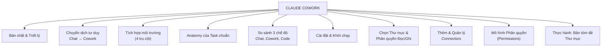

---
tags:
  - claude/nhom
aliases:
  - Claude Cowork
  - Cowork
up: "[[Claude Ecosystem]]"
---

# Claude Cowork

Ghi chú tổng (MOC) cho **Claude Cowork** — môi trường hợp tác (coworking environment) giúp ủy quyền công việc trực tiếp cho Claude ngay trong không gian làm việc thực tế (local, cloud app, trình duyệt), thay vì chỉ hỏi-đáp như Claude Chat. Chi tiết từng mục nằm trong các ghi chú riêng ở thư mục [[Claude Cowork]].

## Sơ đồ gốc

## Các nhánh chính

- [[Bản chất & Triết lý]]
- [[Chuyển dịch tư duy Chat sang Cowork]]
- [[Tích hợp môi trường (4 trụ cột)]]
- [[Anatomy của một Task chuẩn]]
- [[So sánh 3 chế độ làm việc (Chat, Cowork, Code)]]
- [[Cài đặt & Khởi chạy]]
- [[Chọn Thư mục & Phân quyền Đọc-Ghi]]
- [[Thêm & Quản lý Connectors (Cowork)]]
- [[Mô hình Phân quyền (Permissions)]]
- [[Thực hành Bản tóm tắt Thư mục]]

## Liên kết

- Thuộc: [[Claude Ecosystem]]
