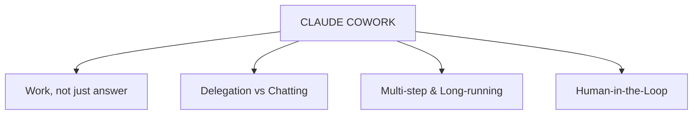

---
tags:
  - claude/cowork
aliases:
  - Bản chất & Triết lý Cowork
up: "[[Claude Cowork]]"
---

# Bản chất & Triết lý

Không phải giao diện chatbot đơn thuần để trả lời câu hỏi, mà là một **môi trường hợp tác (coworking environment)**:

- **Không gian làm việc:** một chế độ (mode) trên Claude Desktop App (Beta trên Cloud/Mobile) — chỉ định cho Claude quyền truy cập trực tiếp một **thư mục local** trên máy.
- **Tích hợp app:** kết nối thẳng hệ sinh thái công cụ thực tế — Gmail, Slack, Google Drive, Google Calendar...
- **Đầu ra (deliverable):** Claude tự lập kế hoạch, làm việc qua nhiều bước, truy cập file/tool cần thiết, rồi **lưu trực tiếp file sản phẩm hoàn chỉnh** trở lại thư mục local.

## 4 điểm cốt lõi

1. **Work, not just answer** — tạo ra sản phẩm đầu ra cụ thể, không dừng lại ở câu trả lời hay văn bản giải thích.
2. **Delegation vs Chatting** — Chat: nơi suy nghĩ, nháp ý tưởng, hỏi đáp trực tiếp. Cowork: mô tả *outcome* mong muốn, Claude tự lập kế hoạch, tự thực thi, bàn giao sản phẩm hoàn chỉnh.
3. **Multi-step & Long-running** — tối ưu cho workflow phức tạp: đi qua nhiều công cụ, chạy dài, kết thúc bằng một artifact thật (báo cáo, source code, dữ liệu đã phân loại...).
4. **Human-in-the-Loop** — hiển thị kế hoạch trước khi chạy; mặc định xin phép trước các hành động nhạy cảm (gửi mail, xóa dữ liệu, chia sẻ tệp); cho phép can thiệp/đổi hướng bất kỳ lúc nào. Chi tiết cơ chế: [[Mô hình Phân quyền (Permissions)]].

## Liên kết

- Thuộc nhóm: [[Claude Cowork]]
- Xem thêm: [[Chuyển dịch tư duy Chat sang Cowork]], [[Tích hợp môi trường (4 trụ cột)]], [[Anatomy của một Task chuẩn]], [[Mô hình Phân quyền (Permissions)]]
