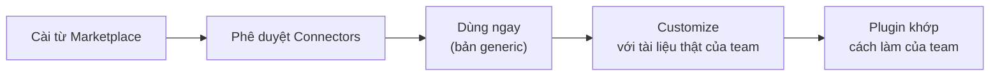

---
tags:
  - claude/cowork
aliases:
  - Cài đặt Plugin Cowork
  - Customize Plugin
  - Tùy biến Plugin
up: "[[Claude Cowork]]"
---

# Cài đặt & Tùy biến Plugins (Cowork)

Cách đưa [[Plugins|Plugin]] có sẵn của Anthropic vào Cowork rồi **chỉnh cho khớp quy trình thật của team**: cài bản chuẩn → tùy biến bằng chính một tác vụ Cowork.

## Cài đặt từ Anthropic Marketplace

Anthropic phát hành sẵn plugin cho các vai trò phổ biến — dùng ngay hoặc làm nền để chỉnh sửa.

1. Vào **Customize** → **Plugins** trong Cowork.
2. Tìm plugin phù hợp lĩnh vực công việc.
3. Bấm **Install**.
4. **Phê duyệt các connector** mà plugin yêu cầu.

- **Kết quả:** toàn bộ Skill của plugin sẵn sàng dùng ngay (gọi bằng slash command hoặc để Claude tự kích hoạt theo mô tả).
- **Lưu ý khi phê duyệt Connector:** plugin sẽ truy cập dữ liệu qua các kết nối này — chỉ cho phép những connector thật sự cần, cấp quyền tối thiểu (xem [[Thêm & Quản lý Connectors (Cowork)]], [[Mô hình Phân quyền (Permissions)]]).

## Vì sao phải tùy biến

Plugin mặc định chứa quy trình **generic**. Mỗi team lại có template, thuật ngữ, cách xử lý riêng — ví dụ Legal plugin chưa biết playbook NDA hay thư viện điều khoản đã duyệt của công ty bạn (xem ví dụ Legal plugin trong [[Plugins]]). Tùy biến biến plugin thành **bản thiết kế đúng cách làm việc của team**.

## Cách tùy biến

1. **Customize** → **Plugins** → chọn plugin đã cài → bấm **Customize**.
2. Hệ thống mở **một tác vụ Cowork mới** — bạn và Claude cùng chỉnh plugin.
3. Cung cấp **ngữ cảnh, link tài liệu, hoặc tải lên file mẫu thực tế**.
4. Claude **tự cập nhật các Skill** trong plugin theo dữ liệu bạn đưa.

Vì đây là một tác vụ Cowork bình thường, các cơ chế quen thuộc đều áp dụng: Claude có thể hỏi làm rõ ([[Cơ chế Câu hỏi Làm rõ (Clarifying Questions)]]), bạn theo dõi qua [[Progress Panel (Bảng tiến độ)]] và có thể chỉnh hướng giữa chừng ([[Điều chỉnh Hướng đi Mid-task (Steer & Interrupt)]]).

### Ví dụ câu lệnh

> *"Đây là 3 bản NDA đã redline gần đây nhất của team mình. Hãy cập nhật skill `/nda-triage` trong plugin này để định dạng và văn phong trùng khớp với các mẫu này."*

Công thức gọn: **file mẫu thật** + **skill cần sửa** + **tiêu chí "trùng khớp" (định dạng, văn phong, bước xử lý)** — tương tự [[Công thức Prompt chuẩn (Deliverable + Inputs + Nuances)]].

> Tên skill trong ví dụ (`/nda-triage`) có thể khác tên hiển thị của từng bản plugin (ví dụ `/nda-review`) — mở danh sách Skill của plugin đã cài để lấy đúng tên.

## Mẹo tùy biến hiệu quả

- **Đưa mẫu thật, không mô tả suông:** 2–3 tài liệu đã được team duyệt cho Claude nhiều tín hiệu hơn một đoạn mô tả dài.
- **Nói rõ cái gì giữ, cái gì đổi:** ví dụ giữ các bước kiểm tra, chỉ đổi định dạng đầu ra và giọng văn.
- **Chỉnh từng Skill một, thử ngay:** chạy thử skill vừa sửa trên một tài liệu thật rồi mới sửa tiếp — vì tùy biến là quá trình lặp, không phải một lần xong.
- **Yêu cầu Claude tóm tắt thay đổi:** để biết Skill nào đã bị sửa và sửa gì, dễ đối chiếu/hoàn tác.
- **Cập nhật khi quy trình đổi:** plugin sống cùng team; khi playbook/template đổi, quay lại Customize thay vì để plugin lỗi thời.
- **Không đưa dữ liệu nhạy cảm không cần thiết:** dùng bản đã ẩn danh khi tải mẫu lên nếu tài liệu chứa thông tin khách hàng/đối tác.

## Giá trị

Claude điều chỉnh plugin trực tiếp — plugin càng sát thực tế công việc, hiệu suất và giá trị cho team càng cao. Đây là bước chuyển từ hướng *off the shelf* sang *customize* trong ba hướng dùng plugin.

## Liên kết

- Thuộc nhóm: [[Claude Cowork]]
- Khái niệm nền: [[Plugins]], [[Skills]]
- Không có plugin phù hợp để customize: [[Tự xây dựng Plugin (Cowork)]]
- Xem thêm: [[Thêm & Quản lý Connectors (Cowork)]], [[Tích lũy Giá trị theo Thời gian (Compounding Value)]], [[Global Instructions & Bộ nhớ theo Ngữ cảnh]]
