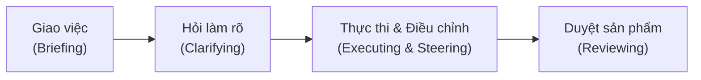

---
tags:
  - claude/cowork
aliases:
  - Nhịp điệu Làm việc
  - Work Rhythm
  - Briefing to Deliverable
up: "[[Claude Cowork]]"
---

# Nhịp điệu Làm việc (Work Rhythm)

Minh họa luồng thực tế của Cowork từ lúc giao việc (delegation) đến lúc bàn giao sản phẩm (deliverable). Nhịp điệu này khác hẳn cách gõ lệnh cho chatbot — giống như **giao việc cho một đồng nghiệp**: nhận brief, hỏi lại khi cần, tự đào sâu xử lý, rồi quay lại với sản phẩm hoàn chỉnh.

## Sơ đồ nhịp điệu

## 3 điểm cốt lõi

1. **Claude hỏi làm rõ trước khi bắt tay vào làm** — với task phức tạp, Claude thường mở đầu bằng 1–2 câu hỏi. Không phải cản trở (friction), mà là cách lấp đầy khoảng trống bối cảnh (context gaps) để đi đúng hướng ngay từ đầu. Chi tiết cơ chế và cách trả lời: [[Cơ chế Câu hỏi Làm rõ (Clarifying Questions)]].
2. **Có thể điều chỉnh hướng đi giữa chừng (steer mid-task)** — thấy Claude lệch hướng thì can thiệp ngay, không cần đợi chạy xong toàn bộ rồi làm lại từ đầu. Chi tiết 2 hình thức can thiệp: [[Điều chỉnh Hướng đi Mid-task (Steer & Interrupt)]].
3. **Sản phẩm hoàn chỉnh là tệp tin thực tế, không phải đoạn chat** — kết quả là các file thay đổi thật trên máy (Word, Excel, PDF...). Vai trò con người ở bước cuối là **duyệt (review)** giống như nghiệm thu công việc của đồng nghiệp, không phải đọc lại hội thoại. Checklist nghiệm thu chi tiết: [[Nghiệm thu Sản phẩm (Review the Deliverable)]].

## Liên kết

- Thuộc nhóm: [[Claude Cowork]]
- Xem thêm: [[Bản chất & Triết lý]] (đặc biệt điểm Human-in-the-Loop), [[Anatomy của một Task chuẩn]], [[Mô hình Phân quyền (Permissions)]], [[Cơ chế Câu hỏi Làm rõ (Clarifying Questions)]], [[Điều chỉnh Hướng đi Mid-task (Steer & Interrupt)]], [[Nghiệm thu Sản phẩm (Review the Deliverable)]]
