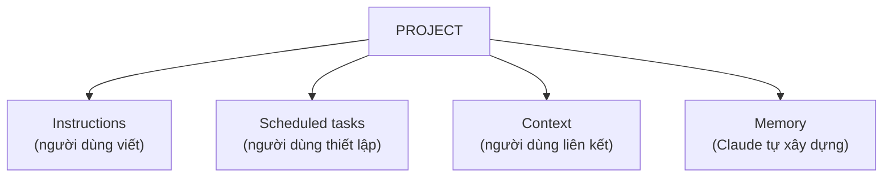

---
tags:
  - claude/cowork
aliases:
  - Project Memory
  - Bộ nhớ dự án (Cowork)
up: "[[Claude Cowork]]"
---

# Projects trong Cowork (4 Thành phần & Bộ nhớ)

Nếu [[Global Instructions & Bộ nhớ theo Ngữ cảnh|Global Instructions]] là quy tắc chung cho **mọi** việc, thì **Project** là không gian riêng cho **một luồng công việc cụ thể** — một khách hàng, một báo cáo định kỳ, một đợt ra mắt sản phẩm. Đây là phiên bản Cowork của khái niệm [[Projects|Projects]] chung ở nền tảng Claude.

## 4 thành phần của một Project

- **Instructions** — hướng dẫn riêng, chỉ áp dụng trong phạm vi dự án này. VD: "Dự án này phục vụ họp tuần — thu thập dữ liệu từ các phòng ban, tổng hợp thành slide báo cáo."
- **Scheduled tasks** — [[Lên lịch Tác vụ (Scheduled Tasks)|tác vụ định kỳ]] thuộc dự án (báo cáo thứ 6 hàng tuần, tóm tắt trước họp); luôn chạy kèm toàn bộ ngữ cảnh dự án.
- **Context** — thư mục/tệp/link được liên kết vào dự án; mọi cuộc trò chuyện trong dự án đều truy cập được.
- **Memory** — duy nhất thành phần **Claude tự học và tự ghi**, không cần người dùng viết tay.

3 thành phần đầu do người dùng chủ động thiết lập; riêng **Memory** tự tích lũy qua quá trình sử dụng.

## Điểm khác biệt lớn nhất: Project Memory

| | Ngoài Project | Trong Project |
| --- | --- | --- |
| Điểm khởi đầu mỗi phiên | Từ đầu, chỉ giữ Global Instructions | Kế thừa toàn bộ bộ nhớ dự án đã tích lũy |
| Ngữ cảnh phiên trước | Không giữ lại | Claude nắm tình hình, quyết định, việc dang dở từ các phiên trước |
| Việc người dùng phải làm | Giải thích lại bối cảnh mỗi lần | Không cần giải thích lại |

> [!tip] So sánh
> Cơ chế này tương tự cách Memory tự học trong [[So sánh 3 chế độ làm việc (Chat, Cowork, Code)|Claude Chat thường]] — khác biệt là ở Cowork, việc tự học này chỉ giới hạn **trong phạm vi một Project**, không lan ra toàn bộ tài khoản.

## 3 cách tạo một Project

Tại sidebar Cowork → **Projects** → **New project** → chọn 1 trong 3 cách sau, tùy nơi đang lưu tài liệu:

1. **From scratch** — bắt đầu dự án trống, bổ sung dần *instructions* và *context* trong quá trình làm việc.
2. **Từ thư mục có sẵn trên máy** — trỏ dự án tới một thư mục tài liệu thực tế; thư mục này trở thành **working directory** chính của dự án.
3. **Chuyển đổi từ Chat project** — mang toàn bộ instructions + knowledge từ dự án Chat thường sang. Đây là chuyển đổi **một chiều** — thay đổi trong Cowork sau đó **không** đồng bộ ngược lại Chat.

Sau khi tạo, có thể đổi working directory, cập nhật instructions, hoặc kết nối lại context bất kỳ lúc nào.

## Liên kết

- Thuộc nhóm: [[Claude Cowork]]
- Xem thêm: [[Mô hình Áp dụng Projects (3 Use Cases)]], [[Global Instructions & Bộ nhớ theo Ngữ cảnh]], [[Tích lũy Giá trị theo Thời gian (Compounding Value)]], [[Projects]], [[Lên lịch Tác vụ (Scheduled Tasks)]]
