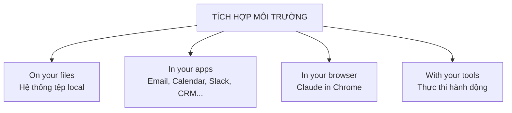

---
tags:
  - claude/cowork
aliases:
  - Tích hợp môi trường Cowork
  - 4 trụ cột tích hợp
up: "[[Claude Cowork]]"
---

# Tích hợp môi trường (4 trụ cột)

Cowork không làm việc "bên cạnh" (adjacent) mà làm việc "bên trong" (inside) môi trường thực tế của người dùng, qua 4 không gian:

1. **Trên hệ thống tệp (On your files)** — đọc trực tiếp dữ liệu từ các thư mục được cấp quyền trên máy; sau khi xử lý, ghi/tạo tệp sản phẩm hoàn chỉnh (báo cáo, spreadsheet, tài liệu) trả ngược lại đúng thư mục đó.
2. **Trong các ứng dụng (In your apps)** — trích xuất bối cảnh thời gian thực từ app đám mây đã kết nối: Email, Google Calendar, nhắn tin (Slack/Teams), Google Drive, CRM.
3. **Trong trình duyệt (In your browser)** — với dịch vụ web không có connector/API, tiện ích **Claude in Chrome** đọc nội dung và thao tác trực tiếp trên trang (dashboard, portal, hệ thống cần đăng nhập).
4. **Thực thi với công cụ (With your tools)** — trực tiếp hành động (gửi mail, tạo task, di chuyển file) chứ không dừng ở mức hướng dẫn phải làm gì.

## Bảng tóm tắt

| Không gian | Cơ chế tương tác | Ví dụ thực tế |
| --- | --- | --- |
| Local Folder | Đọc / Ghi trực tiếp | Đọc 50 file PDF báo cáo, tạo 1 file Excel tổng hợp lưu vào ổ C: |
| Connected Apps | Tích hợp API | Lấy thông tin cuộc họp từ Calendar, tóm tắt thảo luận từ Slack |
| Browser (Chrome) | Thao tác trên giao diện web | Tự động đăng nhập portal nội bộ và trích xuất dữ liệu |
| Action Execution | Thực thi trực tiếp | Tạo task trên Jira thay vì chỉ liệt kê các bước cần làm |

## Liên kết

- Thuộc nhóm: [[Claude Cowork]]
- Xem thêm: [[Bản chất & Triết lý]], [[Anatomy của một Task chuẩn]]
