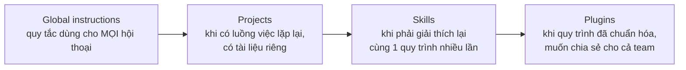

---
tags:
  - claude/cowork
aliases:
  - Compounding Value
  - 4 Khối nền tảng
up: "[[Claude Cowork]]"
---

# Tích lũy Giá trị theo Thời gian (Compounding Value)

Cowork không "quên" sau mỗi phiên — bối cảnh cung cấp một lần sẽ tiếp tục sinh giá trị về sau, nhờ 4 khối nền tảng dưới đây. Càng đầu tư thiết lập, Cowork càng nắm rõ phong cách làm việc và đảm nhận được khối lượng việc lớn hơn, chính xác hơn.

## 4 khối nền tảng

| Khối | Claude học được gì | Giá trị mở ra |
| --- | --- | --- |
| **Global instructions** | Bạn là ai, phong cách làm việc | Mọi tác vụ tự căn chỉnh đúng vai trò/định dạng/sở thích, không cần nhắc lại. Chi tiết cách thiết lập: [[Global Instructions & Bộ nhớ theo Ngữ cảnh]] |
| **Projects** | Bối cảnh của một luồng công việc cụ thể | Claude hoạt động như thành viên thực thụ trong phạm vi dự án — nắm tệp, lịch sử, quyết định trước đó. Chi tiết 4 thành phần & cơ chế bộ nhớ: [[Projects trong Cowork (4 Thành phần & Bộ nhớ)]] |
| **Skills** | Quy trình chuẩn cho một loại việc | Chạy đúng template, đúng quy trình, đúng tiêu chuẩn chất lượng của đội. Xem [[Skills]] |
| **Plugins** | Chuyên môn đặc thù ngành/vai trò | Biến Claude từ generalist thành specialist, chia sẻ được cho cả đội/công ty. Xem [[Plugins]] |

## Lộ trình áp dụng (không cần làm hết ngay từ đầu)

## Bài học cốt lõi

Mọi bối cảnh cung cấp cho Cowork một lần đều tiếp tục mang lại giá trị về sau — đây là lý do nên đầu tư thiết lập 4 khối trên thay vì giải thích lại từ đầu mỗi lần.

## Liên kết

- Thuộc nhóm: [[Claude Cowork]]
- Xem thêm: [[Bản chất & Triết lý]], [[Nền tảng cốt lõi]]
