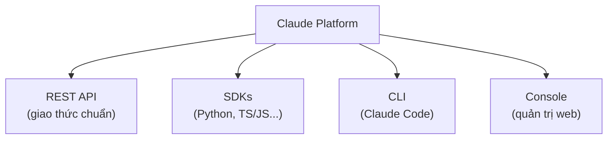
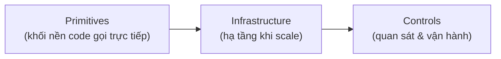
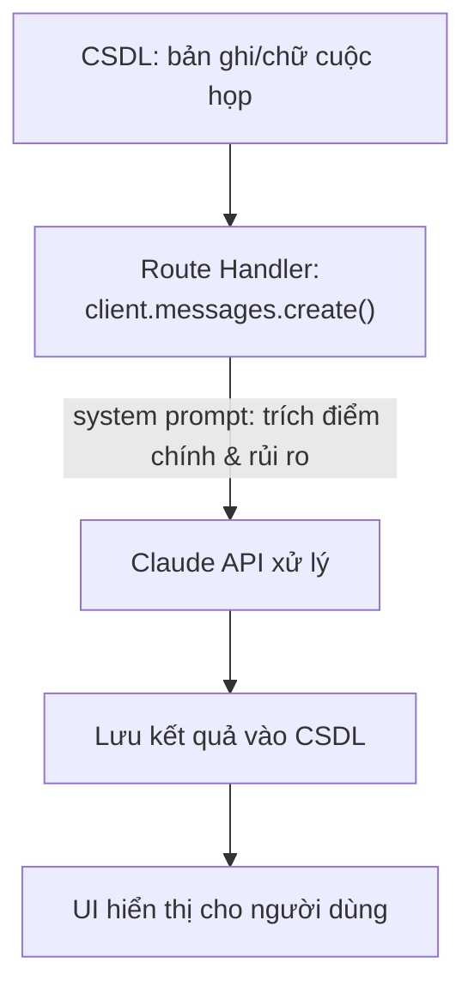

---
tags:
  - claude/nhom
aliases:
  - Claude Platform
  - Nền tảng Claude
  - Developer Platform
up: "[[Claude Ecosystem]]"
---

# Claude Platform (Nền tảng Claude)

Bộ công cụ và hạ tầng kỹ thuật do Anthropic cung cấp để **lập trình viên tích hợp Claude vào ứng dụng/hệ thống qua code**, thay vì chỉ dùng giao diện chat trên web. Cho phép kiểm soát toàn diện: chọn model, giới hạn chi phí, cấp quyền dùng tool ngoài, cấu hình system prompt...

- [[REST API]] — giao thức kết nối chuẩn
- [[SDKs]] — thư viện hỗ trợ theo ngôn ngữ
- [[Claude Code]] — CLI tương tác/cấu hình dịch vụ
- [[Console]] — bảng điều khiển quản trị trên web

## Góc nhìn kiến trúc: 3 tầng

Bên cạnh cách chia theo "cách truy cập" ở trên, có thể nhìn Claude Platform theo chiều sâu kiến trúc — từ lúc viết dòng code đầu tiên đến khi vận hành quy mô lớn:

> Xây dựng bằng **Primitives** → Mở rộng bằng **Infrastructure** → Vận hành bằng **Controls**.

- **Primitives** — các thành phần nguyên bản gọi qua [[REST API]]/[[SDKs]]: Messages API (chọn model — xem [[Model Tiers]]; suy luận trước khi trả lời — xem [[Extended Thinking]]), [[Tool Use (Function Calling)|Tool use]] (cơ chế lặp nhiều lượt: xem [[Vòng lặp Agent]]), xử lý tệp, tìm kiếm web, thực thi code, tích hợp [[Connectors (MCP)|MCP servers]], [[Skills]], giữ ngữ cảnh gọn cho agent chạy dài — xem [[Context Management]]. Định hình logic/khả năng tương tác cơ bản.
- **Infrastructure** — đường ống & đệm giúp lên quy mô lớn: [[Managed Agents]], retry tự động, hàng đợi (queues), observability. Giữ hệ thống ổn định khi lượng gọi API tăng vọt.
- **Controls** — công cụ quan sát/điều chỉnh khi đã production: dashboards theo dõi chi phí/hiệu năng, evals đánh giá chất lượng phản hồi. Thể hiện rõ ngay trên [[Console]].

## Triết lý cốt lõi: từ "hỏi-đáp" sang "tích hợp vào sản phẩm"

Giá trị thực sự của Claude Platform không nằm ở việc dựng thêm một chatbot độc lập, mà là **đưa Claude vào đúng vị trí trong sản phẩm/luồng nghiệp vụ đã có** (ví dụ: thêm nút "Tạo bản nháp" ngay trong hệ thống Helpdesk sẵn có — xem ví dụ ở [[REST API]]).

- **Không thay thế cả giao diện** — chỉ chèn AI vào một bước cụ thể của luồng hiện tại, không cần xây UI chat mới.
- **[[Managed Agents]]** — khi cần agent tự động phức tạp, tầng [[#Góc nhìn kiến trúc 3 tầng|Infrastructure]] không chỉ cấp model mà còn tự vận hành hạ tầng chạy agent đó.
- **Mục tiêu cuối** — biến AI từ công cụ hỏi-đáp rời rạc thành **một phần hữu cơ trong sản phẩm**.

### Từ script thử nghiệm đến tính năng sản phẩm

Cùng một lệnh gọi `messages.create` (xem [[TypeScript]]), khi bọc trong một API Route Handler (Express, Next.js, FastAPI...) sẽ trở thành một tính năng hoàn chỉnh — ví dụ tính năng "Tóm tắt biên bản cuộc họp":

Mọi tính năng AI phức tạp hơn sau này (tóm tắt, phân loại, soạn nháp...) đều là biến thể của cùng một mẫu: request → xử lý → lưu/trả kết quả.

## Liên kết

- Thuộc: [[Claude Ecosystem]]
- Phân biệt với: [[Nền tảng cốt lõi]] (tính năng workspace trong Claude.ai/Claude Code, không phải hạ tầng dev)
- Xem thêm: [[Model Tiers]] (chọn model phù hợp)
- Hạ tầng agent quy mô lớn: [[Managed Agents]]
