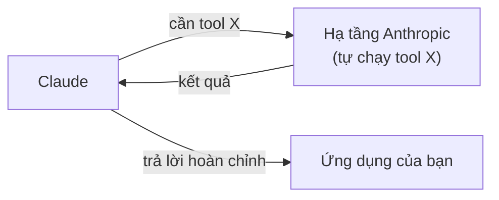

---
tags:
  - claude/nen-tang
aliases:
  - Built-in Tools
  - Server Tools
  - Công cụ tích hợp sẵn
up: "[[Claude Platform]]"
---

# Built-in Tools (Công cụ tích hợp sẵn / Server Tools)

Nhóm tool do **Anthropic tự host và thực thi sẵn** trên hạ tầng của họ — khác với [[Tool Use (Function Calling)|custom tools]] (lập trình viên tự viết hàm + tự chạy), ở đây bạn chỉ cần khai báo là dùng được ngay, không phải tự viết code xử lý hay dựng sandbox riêng.

## Đặc điểm cốt lõi: chạy phía server

> Vì tool chạy ngay trên server Anthropic, Claude tự gọi và nhận kết quả **trong cùng một lượt phản hồi API** — không cần code của bạn tự thực thi rồi gửi `tool_result` ngược lại như custom tools (so sánh với vòng lặp thủ công ở [[Vòng lặp Agent]]).

## 3 built-in tool chính

- **Web search** — tìm kiếm thông tin trên Internet, trả về kết quả kèm **citations** (nguồn dẫn) để kiểm chứng.
- **Code execution** — Claude tự viết và chạy code Python trong sandbox an toàn do Anthropic quản lý (không cần tự dựng môi trường thực thi).
- **Web fetch** — lấy toàn bộ nội dung chi tiết từ một URL cụ thể (khác Web search ở chỗ: fetch cần URL đã biết trước, còn search là đi tìm URL phù hợp).

Ngoài 3 tool trên, Anthropic còn cung cấp thêm các server tool khác cho các use case đặc thù hơn: **bash**, **text editor**, **computer use** (điều khiển máy tính ảo) — xem thêm trong tài liệu [[Tool Use (Function Calling)|Tool Use]].

## Dùng nhiều server tool trong cùng 1 request

Khai báo song song nhiều server tool trong mảng `tools` (mỗi tool định danh theo tên + phiên bản dạng ngày, ví dụ `web_search_20260209`, `code_execution_20260120`) — Claude tự chọn tool phù hợp theo từng câu hỏi mà không cần thêm logic điều hướng nào ở phía ứng dụng.

| Ví dụ yêu cầu | Tool được chọn | Cách hoạt động |
| --- | --- | --- |
| "Tra cứu số liệu X mới nhất" | `web_search_...` | Claude tự tìm trên web, tổng hợp và trả lời kèm trích dẫn nguồn. |
| "Tính trung bình/độ lệch chuẩn của dãy số Y" | `code_execution_...` | Claude tự viết code Python, chạy trong sandbox, lấy `stdout` rồi diễn giải lại bằng lời. |

## Các block type mới trong response

So với response chỉ có `text` (không dùng tool) hoặc `tool_use`/`tool_result` (custom tool), server tool sinh thêm các loại content block:

- **`server_tool_use`** — tương đương `tool_use` nhưng cho server tool: chứa tên tool + tham số Claude quyết định gọi.
- **`{tool}_tool_result`** — kết quả do server tự chạy và tự đính kèm (ví dụ `bash_code_execution_tool_result` chứa `stdout` của đoạn Python vừa chạy). Không phải tự soạn `tool_result` như custom tool.
- **`text`** — câu trả lời cuối cùng Claude diễn giải từ kết quả trên.

Vì các block này đã nằm sẵn trong response, code phía ứng dụng chỉ cần đọc `content` trả về — **không** cần kiểm tra `stop_reason == "tool_use"` rồi tự gửi lượt tiếp theo như [[Vòng lặp Agent|vòng lặp agent thủ công]].

## Giá trị trong Production

- **Rút ngắn thời gian phát triển** — có ngay tính năng vốn tốn nhiều tuần để tự xây (crawler cho web search, môi trường sandbox cách ly cho code execution) mà không cần tự vận hành hạ tầng đó.
- **Ứng dụng thực tế — Fact-check tự động:** dùng Web search để đối chiếu số liệu/quy định pháp lý trong bản thảo với dữ liệu thực tế trên web theo thời gian thực, thay vì chỉ dựa vào kiến thức huấn luyện tĩnh của Claude.

> **Lưu ý:** thông tin tìm thấy trên web không đồng nghĩa là đúng. Vẫn cần cơ chế kiểm tra lại kết quả (human-in-the-loop / validation) trước khi dùng cho quyết định quan trọng — không nên tin tuyệt đối vào output chỉ vì có kèm citation.

## Tầm nhìn mở rộng: Managed Agents

Triết lý "Anthropic tự quản lý & vận hành" ở Server tools không dừng lại ở từng tool riêng lẻ — được mở rộng lên cấp toàn bộ agent qua **Managed Agents** (xem mục cùng tên trong [[Claude Platform]]): thay vì chỉ 1 tool chạy trên server Anthropic, cả vòng lặp agent cũng do Anthropic vận hành.

## Liên kết

- Thuộc nhóm: [[Claude Platform]]
- Phân biệt với: [[Tool Use (Function Calling)]] (custom tools — tự viết & tự thực thi)
- Đối lập với: [[Client Tools]] (schema dựng sẵn nhưng thực thi trên máy bạn, không phải server Anthropic)
- Cơ chế lắp nhiều lượt gọi tool thành agent hoàn chỉnh: [[Vòng lặp Agent]]
