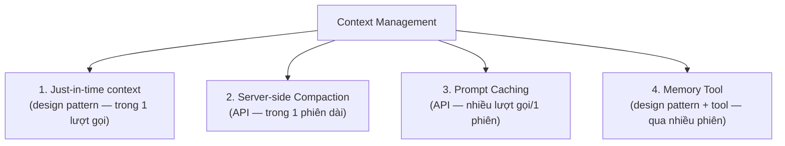
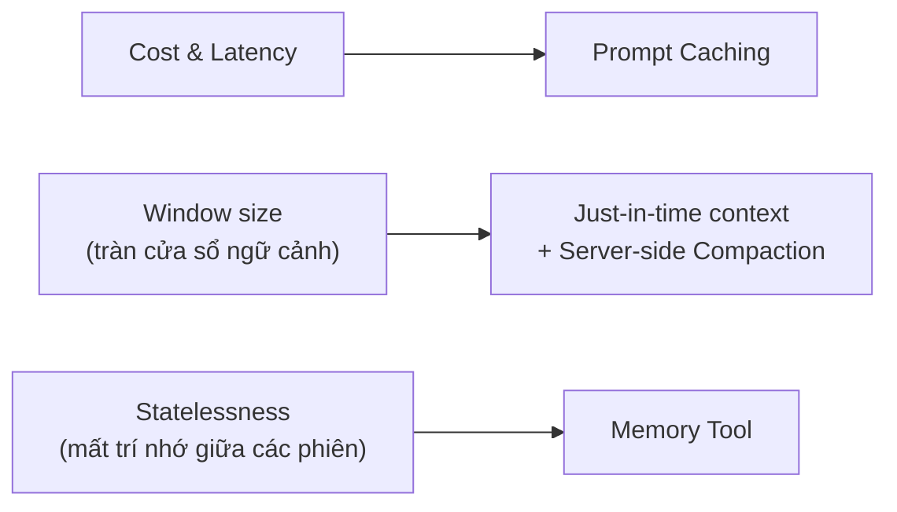

---
tags:
  - claude/nen-tang
aliases:
  - Context Management
  - Quản lý ngữ cảnh
  - Context Engineering
up: "[[Claude Platform]]"
---

# Context Management (Quản lý ngữ cảnh)

## Vấn đề: cửa sổ ngữ cảnh dễ đầy

Dù Claude có cửa sổ ngữ cảnh lớn (vd. 1M token), agent chạy dài (long-running agent) vẫn nhanh chóng chạm giới hạn vì **mỗi lượt gọi API phải gửi lại toàn bộ**: system prompt, lịch sử hội thoại, định nghĩa tool, kết quả tool (thường rất tốn token vì dữ liệu thô), tệp/skill đã nạp, và các khối [[Extended Thinking|thinking]].

Tốn token nghĩa là tốn tiền ở cả hai chiều (input lẫn output), và nếu vượt giới hạn thì request lỗi hoàn toàn. Mục tiêu không phải nhồi nhét mọi thứ, mà là **giữ đúng phần cần thiết trong ngữ cảnh** ở mỗi thời điểm — hoặc tái sử dụng phần không đổi thay vì tính lại.

Anthropic đề xuất 4 mô hình, mỗi mô hình giải quyết một **phạm vi** khác nhau — từ 1 lượt gọi đến xuyên suốt nhiều phiên:



## 1. Just-in-time context (design pattern)

Nguyên lý: **chỉ nạp dữ liệu khi thực sự cần**, thay vì nhồi hết vào system prompt từ đầu. Đây là design pattern — không có tính năng API riêng, lập trình viên tự thiết kế luồng: agent chỉ nhận hướng dẫn cơ bản + danh sách tool, khi gặp câu hỏi cụ thể mới chủ động gọi tool để tra đúng phần dữ liệu cần.

- Agent làm việc với **định danh nhẹ** (lightweight identifiers: đường dẫn file, query đã lưu, link web...) rồi truy vấn động lúc runtime — giống cách con người dùng hệ thống file/bookmark thay vì nhớ hết mọi thứ trong đầu.
- **Ví dụ:** Agent kiểm tra quy chuẩn xây dựng không bị nạp cả cuốn quy chuẩn hàng nghìn trang vào system prompt — khi gặp câu hỏi về "khoảng lùi công trình", nó gọi tool `lookup_building_code` để tra đúng điều khoản đó.
- **Ví dụ khác — Claude Code:** viết query có mục tiêu rõ, lưu kết quả, dùng lệnh Bash như `head`/`tail`/`grep` để phân tích dữ liệu lớn mà không bao giờ nạp toàn bộ file vào ngữ cảnh.
- **Đánh đổi:** chậm hơn cách nạp sẵn (pre-computed), cần thiết kế tool cẩn thận để agent không lạc hướng/tốn lượt tra cứu vô ích. Cách hiệu quả nhất thường là **hybrid**: nạp sẵn một phần dữ liệu cần thiết ngay từ đầu (tốc độ) + cho phép agent tự khám phá thêm khi cần (linh hoạt).

## 2. Server-side Compaction (nén hội thoại)

Khi tổng token input vượt ngưỡng, **API tự tóm tắt và thay thế lịch sử hội thoại cũ** ngay trên hạ tầng Anthropic — không cần code tự đo độ dài hay tự cắt gọt lịch sử. Bản tóm tắt cố giữ quyết định kiến trúc, bug chưa xử lý, chi tiết triển khai quan trọng — bỏ qua tool output/message dư thừa.

- Kích hoạt bằng beta header `compact-2026-01-12`, cấu hình qua `context_management.edits` với `type: "compact_20260112"`.
- `trigger.value` — ngưỡng token kích hoạt nén, mặc định **150.000**, tối thiểu 50.000.
- `pause_after_compaction` (mặc định `false`) — có dừng lại ngay sau khi tạo bản tóm tắt hay không.
- `instructions` — tuỳ chỉnh prompt tóm tắt (thay hoàn toàn prompt mặc định).
- Phải append lại `response.content` (gồm cả block `compaction`) vào `messages` để tiếp tục hội thoại đúng.
- Anthropic khuyến nghị server-side thay vì tự tóm tắt phía client (SDK compaction — chỉ có ở TypeScript/Ruby `tool_runner`, đã **deprecated**).

## 3. Prompt Caching (lưu bản sao Prompt)

Đánh dấu phần **cố định/ít đổi** (system prompt, danh sách tool, tài liệu dài) bằng `"cache_control": {"type": "ephemeral"}` — Anthropic lưu lại kết quả xử lý phần đó. Request sau, nếu phần đánh dấu không đổi, API dùng thẳng bản cache thay vì tính lại từ đầu.

```json
"system": [
  {
    "type": "text",
    "text": "... system prompt rất dài hoặc tài liệu 100k token ...",
    "cache_control": {"type": "ephemeral"}
  }
]
```

**Bài toán kinh tế** (so với input thường, giá tính theo hệ số):

| Thao tác | TTL 5 phút (mặc định) | TTL 1 giờ (tuỳ chọn) |
| --- | --- | --- |
| Cache write | 1.25× | 2.0× |
| Cache read | 0.1× (**rẻ hơn 90%**) | 0.1× |

- **Độ trễ:** giảm 50–80% thời gian tới token đầu tiên (TTFT).
- **TTL mặc định 5 phút**, tự động **gia hạn thêm 5 phút** mỗi lần cache được đọc (cache hit) — không tốn thêm phí gia hạn. TTL tính từ lúc request bắt đầu, không phải lúc response kết thúc, nên response càng dài càng ăn bớt vào TTL còn lại.
- Muốn giữ lâu hơn: `"cache_control": {"type": "ephemeral", "ttl": "1h"}`.
- **Độ dài tối thiểu để cache được** tuỳ model: Opus 5/Fable 5/Mythos 5 ≥ 512 token; Sonnet 5/4.6/4.5, Opus 4.8 ≥ 1.024 token; các model cũ hơn 2.048–4.096 token. Prompt ngắn hơn mức này thì request vẫn chạy bình thường, chỉ không được cache (không báo lỗi).
- **Tối đa 4 cache breakpoint** mỗi request; thứ tự phân cấp cache: `tools` → `system` → `messages` — đổi ở tầng nào thì tầng đó và các tầng sau bị invalidate (vd. đổi định nghĩa tool làm mất cache cả `system` lẫn `messages`; thêm/bớt ảnh chỉ làm mất cache từ `messages` trở đi... tuỳ loại thay đổi).
- Đặt `cache_control` ở **khối cuối cùng còn giữ nguyên** giữa các request — không đặt vào phần hay đổi (timestamp, dữ liệu theo từng request).
- Theo dõi hiệu quả qua `usage`: `cache_creation_input_tokens`, `cache_read_input_tokens`, `input_tokens` (phần sau breakpoint cuối, không được cache).

## 4. Memory Tool (bộ nhớ ngoài, xuyên phiên)

Nếu 3 pattern trên phục vụ **một phiên làm việc**, Memory Tool giải quyết bài toán **giữ thông tin xuyên suốt nhiều phiên (cross-session)** — Claude đọc/ghi file trong một thư mục ảo `/memories` để xây dựng kiến thức dần theo thời gian mà không cần nhồi hết vào cửa sổ ngữ cảnh.

- **Kiến trúc client-side:** Anthropic chỉ định nghĩa **chuẩn giao tiếp** (`{"type": "memory_20250818", "name": "memory"}` trong `tools`) — Claude chỉ *yêu cầu* thao tác file, ứng dụng của bạn mới là nơi *thực thi* và lưu trữ thật (file JSON, DB, S3, Redis...). Nhiều SDK có sẵn helper (`BetaLocalFilesystemMemoryTool`...) để không phải tự viết từ đầu.
- **6 lệnh (command) chuẩn** mà handler phía client phải xử lý: `view` (xem thư mục/nội dung file, có thể giới hạn `view_range`), `create` (tạo file), `str_replace` (thay thế đoạn text), `insert` (chèn tại dòng chỉ định), `delete` (xoá file/thư mục — không được xoá gốc `/memories`), `rename` (đổi tên/di chuyển).
- **Bắt buộc chống path traversal:** validate mọi path phải nằm trong `/memories`, chặn các chuỗi kiểu `../` hoặc dạng mã hoá URL của nó — vì ứng dụng thực thi trực tiếp yêu cầu từ model.
- **Tự động chèn system instruction:** chỉ cần khai báo memory tool trong `tools`, Anthropic tự thêm chỉ dẫn ẩn buộc Claude phải `view` thư mục memory **trước khi làm bất cứ việc gì**, và ghi lại tiến độ vì "ngữ cảnh có thể bị reset bất cứ lúc nào".
- **Luồng thực tế:** đầu phiên → Claude gọi `view /memories` để nạp thông tin nền (sở thích người dùng, tiến độ dự án) → trong lúc làm việc, gặp thông tin quan trọng mới (vd. "chốt dùng Tailwind") → chủ động `create`/`str_replace`/`insert` để lưu lại.
- **Pattern đa phiên cho dự án phần mềm:** phiên đầu (initializer) dựng sẵn file tiến độ (progress log), checklist tính năng, script khởi tạo dự án; các phiên sau đọc lại các file này để phục hồi trạng thái mà không cần khám phá lại codebase; cuối mỗi phiên cập nhật progress log — chỉ đánh dấu hoàn thành khi đã verify end-to-end.
- Đây chính là cơ chế bộ nhớ persistent mà Claude Code đang dùng ở thư mục `memory/` (ghi chú về user, feedback, project, reference — xem hướng dẫn ở đầu phiên).

## Phối hợp cả 4 pattern trong production (Layering)

Thực tế production **không chọn 1-trong-4** mà thường **chồng cả 4 pattern cùng lúc**, vì mỗi pattern chặn một **nguy cơ thất bại (failure mode)** khác nhau — dùng thiếu pattern nào thì vẫn hở đúng nguy cơ đó:



- **Cost & Latency → Prompt Caching:** cache system prompt dài + định nghĩa tool cố định, để gọi API hàng trăm lần/giờ mà không vỡ ngân sách hay tăng độ trễ.
- **Window size → Just-in-time context + Server-side Compaction (2 lớp phòng thủ khác nhau cho cùng 1 vấn đề):** Just-in-time giữ prompt ban đầu siêu nhẹ (chỉ nạp đúng điều khoản cần khi có câu hỏi cụ thể); Compaction xử lý phần phát sinh trong lúc hội thoại — khi đã kéo dài hàng chục lượt, server tự nén các lượt cũ để không tràn cửa sổ token.
- **Statelessness → Memory Tool:** mỗi phiên gọi API vốn không nhớ gì phiên trước — Memory Tool là lớp duy nhất trong 4 pattern giải quyết việc này, ghi sở thích người dùng/quyết định của tuần trước ra bộ nhớ ngoài để tuần sau dùng lại.

> **Mẹo triển khai nhanh:** có thể tự nối (wire up) từng pattern bằng tay qua SDK/API như mô tả ở trên, hoặc dùng **Claude Managed Agents** — hạ tầng agent do Anthropic vận hành, đã bật sẵn Prompt Caching và Compaction mặc định trong harness (cùng các tối ưu khác), không cần tự cấu hình `context_management`.

## Recap

| Pattern | Phạm vi | Failure mode giải quyết | Cách hoạt động chính |
| --- | --- | --- | --- |
| 1. Just-in-time context | Trong 1 lượt gọi | Window size | Design pattern — chỉ tra cứu qua tool khi cần, giữ prompt ban đầu gọn |
| 2. Server-side Compaction | Trong 1 phiên dài | Window size | API (`compact_20260112`) — tự động tóm tắt & thay thế lịch sử cũ khi vượt ngưỡng token |
| 3. Prompt Caching | Nhiều lượt gọi trong 1 phiên | Cost & Latency | API (`cache_control: ephemeral`) — giảm ~90% chi phí đọc + giảm 50–80% độ trễ cho phần prompt cố định |
| 4. Memory Tool | Xuyên nhiều phiên | Statelessness | Design pattern + tool (`memory_20250818`) — đọc/ghi bộ nhớ ngoài để lưu dữ liệu xuyên session |

> **Liên quan nhưng không nằm trong 4 pattern trên:**
>
> - **Context Editing** (`clear_tool_uses_20250919` / `clear_thinking_20251015`) — xoá chọn lọc tool result/thinking cũ, khác Compaction ở chỗ không tóm tắt mà chỉ cắt bỏ; có thể kết hợp cùng Memory Tool (ghi lại trước khi bị dọn). Chi tiết: skill `claude-api`.
> - **Sub-agent Architecture** — chia việc cho agent con có ngữ cảnh riêng, chỉ trả tóm tắt ~1–2k token về agent chính; là design pattern ở cấp *kiến trúc hệ thống multi-agent*, khác 4 pattern trên vốn tập trung vào một agent/hội thoại đơn lẻ. Claude Code áp dụng qua tool `Task`/subagent — xem [[Vòng lặp Agent]].

## Liên kết

- Thuộc nhóm: [[Claude Platform]]
- Suy luận nội bộ cũng chiếm ngữ cảnh: [[Extended Thinking]]
- Cơ chế lặp gọi tool nhiều lượt liên quan trực tiếp đến việc quản lý ngữ cảnh: [[Vòng lặp Agent]], [[Tool Use (Function Calling)]]
- Chi tiết API đầy đủ (tham số, betas, ví dụ code): skill `claude-api` khi cần tra cứu.
