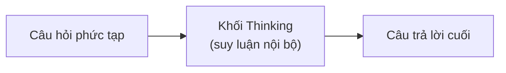
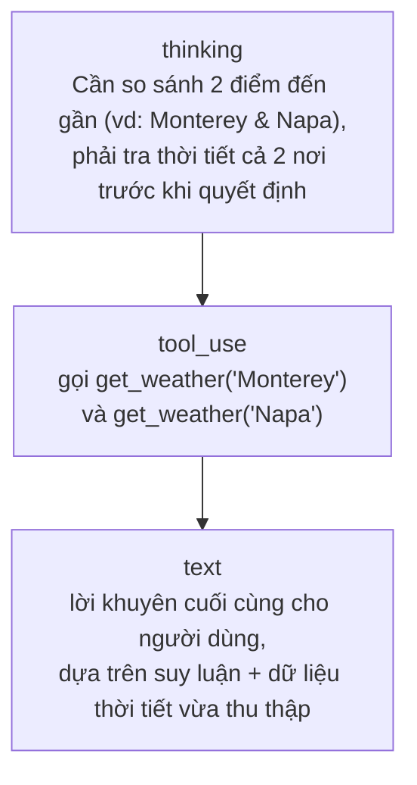

---
tags:
  - claude/nen-tang
aliases:
  - Extended Thinking
  - Suy luận mở rộng
  - Adaptive Thinking
up: "[[Claude Platform]]"
---

# Extended Thinking (Suy luận mở rộng)

## Vấn đề cần khắc phục

Khi bị yêu cầu trả lời ngay một câu hỏi nhiều bước logic, LLM có xu hướng **sinh token tiếp theo dựa trên xác suất tức thời** — dễ ra kết quả sai nhưng trình bày rất tự tin, vì mô hình không có "thời gian" lập kế hoạch trước khi trả lời.

**Extended Thinking** là cơ chế Claude tự sinh ra các **khối suy luận nội bộ (`thinking` block)** — phân tích, thử hướng giải, tự sửa lỗi — trước khi chốt câu trả lời cuối. Khác với chain-of-thought yêu cầu qua prompt, đây là tham số API chính thức, và các khối suy luận này **không bị ẩn** — trả về cùng response, đọc được song song với câu trả lời cuối.



## Bật qua API

Cách hiện hành (Fable 5 / Mythos 5 / Opus 5 / Sonnet 5 / Opus 4.6-4.8 / Sonnet 4.6): **adaptive thinking** — Claude tự quyết định *có* suy luận hay không và suy luận *bao lâu*, không cần chọn số token cố định:

```json
"thinking": { "type": "adaptive" }
```

- Trên **Fable 5/Mythos 5**: thinking luôn bật, không thể tắt — bỏ trống tham số `thinking` (hoặc gửi `adaptive`) là đủ; gửi `disabled` hay `budget_tokens` đều bị lỗi 400.
- Trên **Opus 5/Sonnet 5/4.6-4.8**: mặc định cũng chạy adaptive; có thể tắt bằng `{"type": "disabled"}` (Opus 5 chỉ chấp nhận tắt ở effort `high` trở xuống).
- **`budget_tokens` (ngân sách token cố định) đã lỗi thời** — cách cũ `thinking: {type: "enabled", budget_tokens: N}` chỉ còn hoạt động trên model cũ hơn 4.6; dùng model mới thì báo lỗi 400.
- Độ sâu suy luận giờ điều chỉnh qua **`output_config.effort`** (`low`→`max`) thay vì ngân sách token — xem thêm góc nhìn chi phí/model ở [[Model Tiers]].

### Cấu hình `effort`

> **Gotcha:** `effort` nằm **bên trong** đối tượng `output_config`, không đặt cạnh khối `thinking`.

```json
"output_config": { "effort": "high" }
```

| Mức `effort` | Khi dùng |
| --- | --- |
| `low` | Suy luận ngắn gọn, ưu tiên tốc độ — tác vụ đơn giản, subagent phụ. |
| `medium` | Mức trung bình. |
| `high` | **Mặc định** — cân bằng độ sâu/chi phí, hợp lý cho hầu hết use case. |
| `xhigh` | Suy luận chuyên sâu — hợp nhất cho code/agentic phức tạp. |
| `max` | Tối đa khả năng tư duy — dùng khi độ chính xác quan trọng hơn chi phí. |

## Khi nào nên và không nên bật Extended Thinking

| NÊN dùng | KHÔNG NÊN dùng |
| --- | --- |
| Toán học/logic nhiều bước | Phân loại (classification) đơn giản |
| Debug code phức tạp | Trích xuất thông tin ngắn (extraction) |
| Phân tích văn bản pháp lý/quy chuẩn | Tạo văn bản/code mẫu cơ bản (boilerplate) |
| Bài toán cần cân nhắc đánh đổi giữa nhiều phương án | — |

Bật thinking cho các tác vụ đơn giản chỉ **tăng độ trễ và chi phí** mà không nâng chất lượng đầu ra — vì vậy adaptive thinking (để Claude tự quyết định mức suy luận cần thiết) thường tốt hơn ép `effort` cao cho toàn bộ hệ thống.

## `display` — ẩn/hiện phần suy luận

Tham số `display` chỉ kiểm soát việc **có hiển thị lại** nội dung suy luận cho người dùng hay không — suy luận vẫn luôn xảy ra và vẫn bị tính phí như nhau, bất kể `display` là gì:

- `"summarized"` — trả về bản tóm tắt dễ đọc của quá trình suy luận.
- `"omitted"` (mặc định trên các model mới) — vẫn có khối `thinking` nhưng nội dung để trống.
- Chuỗi suy luận gốc (raw chain-of-thought) **không bao giờ** được trả về nguyên văn, kể cả khi chọn `summarized`.

## Gửi lại khối thinking khi tiếp tục hội thoại

Mỗi khối `thinking` mang một **`signature`** để API xác thực. Khi tiếp tục hội thoại nhiều lượt (đặc biệt xen giữa các lượt gọi tool), phải gửi lại **nguyên vẹn, không chỉnh sửa** các khối thinking trước đó — kể cả khối có nội dung rỗng do `display: omitted`. Sửa hoặc bỏ khối thinking dễ gây lỗi 400 do sai thứ tự/signature.

- **`redacted_thinking`** — trên một số model cũ hơn, nếu nội dung suy luận bị hệ thống an toàn gắn cờ, khối đó được mã hóa (encrypted) thay vì trả về dạng đọc được; vẫn phải gửi lại y nguyên để giữ tính hợp lệ của lượt hội thoại.
- Khối thinking (loại thường) **không bị khoá theo model** — có thể tái sử dụng khi đổi model khác giữa các lượt. Riêng thinking của Fable 5/Mythos 5 là ngoại lệ: bị loại bỏ âm thầm khỏi prompt nếu replay sang model khác (không tính phí phần bị loại).

## Interleaved thinking (suy luận xen giữa các lượt gọi tool)

Khi Claude vừa cần gọi tool vừa cần suy luận nhiều bước (xem [[Tool Use (Function Calling)]], [[Vòng lặp Agent]]), **adaptive thinking tự động cho phép Claude suy luận xen kẽ giữa các lượt gọi tool** — không cần khai báo beta header riêng như cách cũ. Nhờ vậy Claude có thể "nghĩ lại" sau khi nhận `tool_result` trước khi quyết định bước tiếp theo, thay vì phải chốt toàn bộ kế hoạch ngay từ đầu.

### Ví dụ: lập kế hoạch road trip (cân nhắc thời tiết vs. thời gian di chuyển)

```python
response = client.messages.create(
    model="claude-opus-5",
    max_tokens=16000,
    thinking={"type": "adaptive"},
    output_config={"effort": "high"},   # phù hợp bài toán cần cân nhắc đánh đổi
    tools=[weather_tool],
    messages=[...],
)
```

- `max_tokens` phải đặt đủ lớn — tổng token tính **cả phần thinking lẫn phần trả lời**, đặt quá thấp dễ bị cắt giữa chừng.

`response.content` trả về tuần tự các khối theo đúng luồng suy luận → hành động → trả lời:



Toàn bộ quá trình suy luận được công khai trong khối `thinking` — đọc được chính xác cách Claude cân nhắc rủi ro/phương án trước khi chốt câu trả lời, không phải hộp đen.

## Giá trị trong production

Khác biệt lớn nhất giữa agent thường và agent có bật Extended Thinking: agent thường kiểm tra thông tin rời rạc theo từng mục, còn agent có adaptive thinking **kết nối được dữ liệu xuyên suốt toàn bộ tài liệu** trước khi kết luận.

> **Ví dụ:** Compliance Review Agent (xem [[Tool Use (Function Calling)#Tích hợp vào hệ thống thực tế (Production)|ví dụ Compliance Agent]]) có thể phát hiện thông số tải trọng gió ở Mục 3 mâu thuẫn với quy chuẩn vật liệu ghi ở Mục 8 — hai chỗ cách xa nhau trong văn bản mà kiểm tra đơn lẻ từng mục sẽ bỏ sót.

## Recap

| Khái niệm | Ghi nhớ |
| --- | --- |
| Extended/Adaptive Thinking | Claude tự sinh khối `thinking` để suy luận trước khi trả lời, không bị ẩn khỏi response |
| Bật | `thinking: {"type": "adaptive"}` — cách hiện hành, thay cho `budget_tokens` cũ |
| Điều chỉnh độ sâu | `output_config.effort` (`low`→`max`), **nằm trong `output_config`** — không phải ngân sách token |
| Use case | Dùng cho toán/logic nhiều bước, debug phức tạp, pháp lý, đánh đổi phương án — không dùng cho classification/extraction/boilerplate |
| `display` | Chỉ ẩn/hiện, không ảnh hưởng việc suy luận có xảy ra hay chi phí |
| `signature` | Bắt buộc gửi lại nguyên vẹn khối thinking cũ khi tiếp tục hội thoại |
| `redacted_thinking` | Khối thinking bị mã hoá khi nội dung bị gắn cờ an toàn (model cũ) |
| Interleaved thinking | Suy luận xen giữa các lượt gọi tool — tự động khi dùng adaptive thinking |
| Giá trị production | Kết nối dữ liệu xuyên suốt tài liệu (vd: phát hiện xung đột logic giữa các mục xa nhau), thay vì kiểm tra rời rạc từng phần |

## Liên kết

- Thuộc nhóm: [[Claude Platform]]
- Điều chỉnh độ sâu suy luận theo tier/effort: [[Model Tiers]]
- Suy luận xen giữa các lượt gọi tool trong một agent: [[Tool Use (Function Calling)]], [[Vòng lặp Agent]]
- Chi tiết API đầy đủ (migration, betas cũ, các trường hợp đặc biệt theo model): skill `claude-api` khi cần tra cứu.
