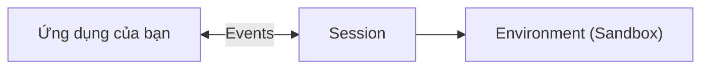
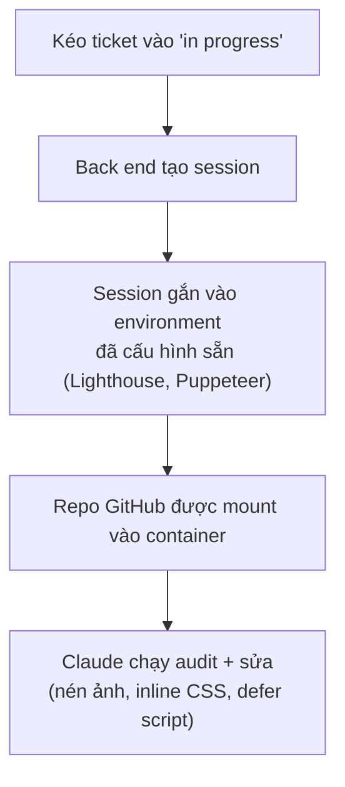
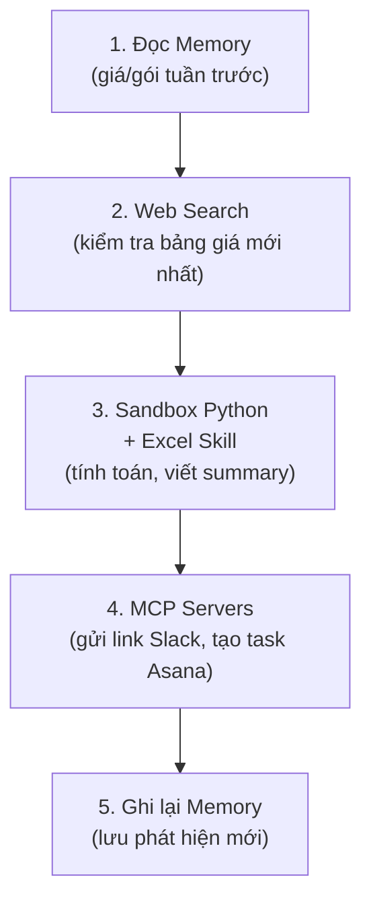
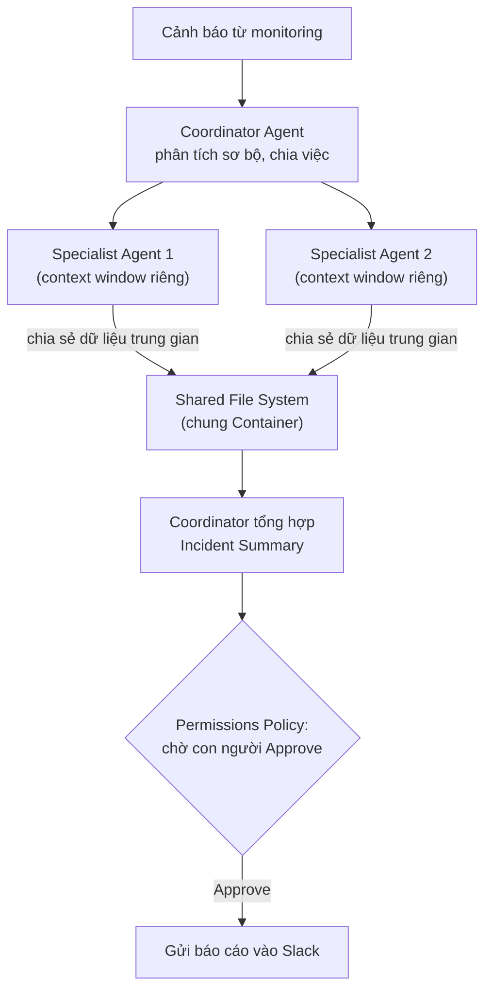
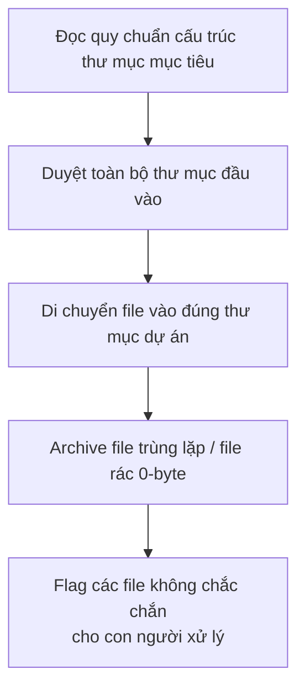

---
tags:
  - claude/nen-tang
aliases:
  - Managed Agents
  - Claude Managed Agents
up: "[[Claude Platform]]"
---

# Managed Agents

Bộ API cho phép định nghĩa, triển khai và vận hành AI Agent ở quy mô production **mà không cần tự dựng hạ tầng**: Anthropic host toàn bộ [[Vòng lặp Agent|vòng lặp Agent]] và sandbox thực thi trên server của họ, thay vì code của bạn tự giữ vòng lặp như khi tự viết tay hoặc dùng [[Tool Runner]].

## 4 Thành phần cốt lõi (The Four Primitives)

4 khái niệm nền tảng ráp nối tuần tự để tạo nên một Agent chạy được — 3 trong số này (Agent, Environment, Session) cũng nằm trong [[#8 thành phần nền tảng (Building Blocks)|8 building blocks]] bên dưới, còn **Events** là cơ chế giao tiếp xuyên suốt tất cả:

1. **Agent** — bản thiết kế cố định: model, system prompt, toolset. Tái sử dụng được cho nhiều session khác nhau.
2. **Environment** — môi trường thực thi (cloud hoặc local), cấu hình sẵn quy tắc mạng, quyền hạn, thư viện.
3. **Session** — lần chạy thực tế của một Agent bên trong một Environment cụ thể; **là đơn vị công việc (unit of work)** cho một nhiệm vụ.
4. **Events** — dòng tin nhắn xuyên suốt phiên chạy: hành động của Agent, lời gọi tool, kết quả trả về, phản hồi.

### Sự chuyển dịch tư duy: từ vòng lặp sang Event Stream

- **Cách cũ** — ứng dụng chạy vòng lặp `while`, chủ động kiểm tra trạng thái, tự gọi hàm xử lý logic.
- **Cách mới** — không còn vòng lặp `while` phía ứng dụng; bạn chỉ **gửi Event vào** và **đọc Event trả ra** qua Event Stream, Session tự vận hành phần còn lại bên trong Environment.

| Khái niệm | Vai trò trong hệ thống | Tương đương lập trình truyền thống |
| --- | --- | --- |
| **Agent** | Định nghĩa cấu hình & năng lực | Class / Struct |
| **Environment** | Môi trường sandbox thực thi | Docker Container / Virtual Machine |
| **Session** | Tiến trình xử lý một nhiệm vụ cụ thể | Instance / Job / Process |
| **Events** | Luồng dữ liệu giao tiếp hai chiều | WebSocket Messages / Event Stream |

## Khi nào nên chuyển từ tự viết Loop sang Managed Agents

- **Tự viết loop vẫn ổn** — tác vụ ngắn, phản hồi nhanh (vài giây), logic đơn giản, ít lần gọi tool.
- **Tự viết loop bắt đầu thất bại** — tác vụ chạy **kéo dài nhiều phút/giờ**, gọi hàng chục tool nối tiếp, đọc/ghi file liên tục, quản lý trạng thái (state) phức tạp, hoặc có rủi ro đứt kết nối mạng giữa chừng → server tự host dễ quá tải bộ nhớ và mất ổn định khi cố tự khôi phục.
- **Managed Agents giải quyết bằng cách nào** — bạn chỉ định nghĩa Agent một lần, cấu hình Environment (sandbox) và kích hoạt Session; toàn bộ suy luận, gọi tool, đọc kết quả, xử lý file và tự khôi phục khi gặp sự cố mạng do Anthropic tự vận hành. Server của bạn chỉ cần lắng nghe **event stream** phát về theo thời gian thực, không phải tự giữ vòng lặp.
- **Sẵn sàng dùng ngay** — tính năng mở mặc định cho toàn bộ tài khoản API, không cần đăng ký hay xin cấp quyền đặc biệt.

> **Quy tắc chọn giải pháp**
>
> - Dùng **Managed Agents** khi nhiệm vụ chạy quá lâu, thao tác dữ liệu phức tạp, cần lưu trạng thái, hoặc cần sống sót qua sự cố mạng.
> - Dùng **Manual Loop** (tự viết, xem [[Vòng lặp Agent]]) khi nhiệm vụ ngắn, phản hồi tức thì, và bạn muốn kiểm soát tuyệt đối từng bước chạy.

## 8 thành phần nền tảng (Building Blocks)

Để tạo một Agent **có trạng thái (stateful)** hoạt động hoàn chỉnh, Managed Agents ráp nối 8 mảnh ghép:

- **Agents** — bản thiết kế: persona, năng lực, danh sách [[Tool Use (Function Calling)|tool]] được cấp quyền.
- **Sessions** — lượt chạy thực tế do ứng dụng của bạn kích hoạt, mỗi session ứng với 1 nhiệm vụ (xem [[#Ví dụ thực tế 1: Kanban board tự động hoá|ví dụ 1]]).
- **Environments** — sandbox cô lập, cài sẵn packages, kiểm soát quyền truy cập mạng.
- **Tools** — công cụ tùy chỉnh tự phát triển trên backend nội bộ.
- **MCP** — kết nối chuẩn hoá tới dịch vụ ngoài (Slack, Asana, GitHub...) — xem [[MCP Connector (API)]].
- **Memory** — đọc bối cảnh cũ trước khi chạy, ghi lại phát hiện mới khi hoàn thành (xem [[#Ví dụ thực tế 2: Recurring Agent theo dõi chi phí SaaS|ví dụ 2]], [[#Ví dụ thực tế 3: Xử lý sự cố (Incident Response) đa Agent|ví dụ 3]]).
- **Outcomes (Rubrics & Graders)** — tiêu chuẩn "hoàn thành là như thế nào" + bộ chấm điểm độc lập buộc Agent tự sửa lỗi đến khi đạt (xem ví dụ 1).
- **Multi-agent coordination** — Coordinator Agent phân việc cho các Specialist Agent (xem ví dụ 3).

## Cấu hình qua Claude Console

- **Định nghĩa Agent** — persona (vai trò/tính cách), quyền dùng [[Tool Use (Function Calling)|tools]], phạm vi năng lực cụ thể.
- **Cấu hình Sandbox** — môi trường cách ly có sẵn packages cài trước, kiểm soát quyền truy cập mạng (network controls).
- **Chạy session** — từ phần mềm của bạn, gọi API để kích hoạt session; toàn bộ xử lý (file system, bash execution, tìm kiếm web an toàn) diễn ra trong container cô lập trên hạ tầng Anthropic, không phải server của bạn.

## Khác biệt so với tự viết vòng lặp

| | Tự xây dựng (Manual / [[Tool Runner]]) | Managed Agents |
| --- | --- | --- |
| Agent loop | Tự viết `while`/`for`, tự bắt lỗi, tự quản timeout | Anthropic vận hành tự động trên cloud |
| Môi trường thực thi | Tự dựng server/Docker container | Sandbox container cô lập có sẵn (file, bash, web) |
| Quản lý khi scale | Tự code backend, tự scale | Cấu hình trực tiếp trên [[Console]] |
| Trách nhiệm của bạn | Viết code điều khiển `while`/`switch`, tự retry | Chỉ gửi yêu cầu & lắng nghe event stream |

## Vị trí trong kiến trúc 3 tầng

Thuộc tầng **Infrastructure** (xem [[Claude Platform#Góc nhìn kiến trúc 3 tầng]]) — nằm giữa Primitives (Messages API, Tool use) và Controls (dashboards, evals): giúp agent phức tạp lên quy mô lớn mà không phải tự lo đường ống/hạ tầng.

## Ví dụ thực tế 1: Kanban board tự động hoá

Minh hoạ cách tích hợp Managed Agents vào một sản phẩm có sẵn — kéo ticket "optimize website performance" vào cột "in progress" sẽ tự kích hoạt session, không cần thao tác thủ công nào khác:

- **Rubric = tiêu chí "done"** — khai báo trước (vd: Lighthouse score > 90, không có render-blocking resource, ảnh lazy-load) để biết khi nào task hoàn thành.
- **Theo dõi real-time** — mọi tool call của Claude stream ngược về board qua event stream, xem được tiến trình khi đang chạy.
- **Vòng lặp chấm điểm (grader loop)** — một grader riêng (chạy ở context window khác) so kết quả với rubric, trả feedback; Claude đọc feedback, sửa tiếp, nộp lại — lặp đến khi đạt (demo: điểm Lighthouse tăng dần lên 96).
- **Chạy song song** — kéo thêm ticket thứ hai trong lúc ticket đầu chưa xong sẽ tạo session + container riêng biệt, hai task chạy độc lập cùng lúc.

## Ví dụ thực tế 2: Recurring Agent theo dõi chi phí SaaS

Một Agent chạy **định kỳ** (vd: sáng thứ Hai trước stand-up) kết hợp cả 4 thành phần cốt lõi — [[Vòng lặp Agent#Điểm cần nhớ|Tools]], [[Skills]], [[MCP Connector (API)|MCP Servers]] và **Memory** — để tự chuẩn bị báo cáo chi phí SaaS hàng tuần:

| Thành phần | Vai trò trong ví dụ |
| --- | --- |
| **Memory Store** | Lưu/đọc thông tin giữa các tuần để phát hiện thay đổi theo thời gian (cross-session). |
| **Sandbox Environment** | Chạy script Python phân tích chi phí an toàn trong container. |
| **[[Skills]]** | Quy định cấu trúc báo cáo Excel và cách viết executive summary. |
| **[[MCP Connector (API)\|MCP Servers]]** | Kết nối sẵn tới Slack (gửi link) và Asana (tạo task) — không cần tự viết tích hợp. |

**Giá trị cốt lõi của Memory** — không có nó, mỗi lần chạy chỉ liệt kê lại bảng giá tĩnh giống hệt nhau. Nhờ đọc/ghi Memory qua từng phiên (cross-session), Agent so sánh được sự thay đổi và đưa ra nhận định có giá trị (vd: *"chi phí compute tuần này giảm 15% so với tuần trước"*) thay vì chỉ báo cáo số liệu rời rạc.

## Ví dụ thực tế 3: Xử lý sự cố (Incident Response) đa Agent

Kết hợp **phối hợp đa Agent**, **Human-in-the-loop** và **Memory** để xử lý sự cố hệ thống nhanh hơn:

- **Coordinator Agent** — nhận cảnh báo, phân tích sơ bộ, giao việc cho các Specialist Agent chuyên trách.
- **Specialist Agents** — chạy song song, mỗi agent giữ context window riêng (tránh tràn ngữ cảnh) nhưng **dùng chung file system** trong container để trao đổi dữ liệu trung gian.
- **Human-in-the-loop** — trước khi gửi báo cáo vào Slack, Permissions Policy tạm dừng để kỹ sư xem bản nháp; chỉ khi con người **Approve**, tin nhắn mới thực sự gửi đi — chặn các hành vi nhạy cảm AI tự ý thực hiện.
- **Memory** — Coordinator tra cứu sự cố cũ trong Memory Store, nhận diện quy luật đã biết (vd: "lỗi DNS do TTL sai từ 2 tuần trước") thay vì chẩn đoán lại từ đầu, rút ngắn MTTR (Mean Time to Resolution).

| Thành phần | Vai trò |
| --- | --- |
| **Coordinator Agent** | Điều phối, giao việc cho Specialist, tổng hợp báo cáo cuối. |
| **Specialist Agents** | Xử lý chuyên sâu độc lập — tách Context Window, chung File System. |
| **Permissions Policy** | Cơ chế Human-in-the-loop — yêu cầu con người phê duyệt trước khi hành động nhạy cảm. |
| **Memory Store** | Đối chiếu sự cố hiện tại với lịch sử để tìm nguyên nhân gốc rễ nhanh hơn. |

## Ví dụ thực tế 4: Tự động dọn dẹp hệ thống lưu trữ file (Fileshare Cleanup)

Bài toán điển hình cho Managed Agents: **chạy lâu, thao tác nhiều file, hoạt động độc lập** — sắp xếp lại một thư mục hàng nghìn file lộn xộn theo cấu trúc dự án chuẩn:

- **Đặc điểm** — tiến trình có thể kéo dài hàng chục phút trên hàng nghìn file thao tác liên tục.
- **Dashboard chỉ tiêu thụ Event Stream** — ứng dụng chỉ lắng nghe [[#4 Thành phần cốt lõi (The Four Primitives)|Event Stream]] để hiển thị tiến độ phân loại file theo thời gian thực, không tự chạy hay lưu trạng thái tác vụ — nên không lo sập server nội bộ dù tác vụ chạy rất lâu.

## Recap

- **Bản chất** — bộ API xây & triển khai Agent ở quy mô production ngay trên hạ tầng cloud của Anthropic.
- **Agent Loop tự động** — Suy luận → Gọi tool → Đọc kết quả → Lặp lại, vận hành hoàn toàn trong container cô lập (quyền truy cập file, chạy Bash, tìm kiếm web).
- **Vận hành linh hoạt** — nhiều session chạy song song trong environment riêng biệt, stream tool call về ứng dụng theo thời gian thực.
- **Đảm bảo chất lượng** — Rubric + Grader độc lập tự buộc Agent tối ưu sản phẩm đến khi đạt chuẩn.
- **Kiểm soát & kết nối** — tích hợp sẵn Memory, MCP, tool nội bộ, chính sách phê duyệt từ con người (Human-in-the-loop/Permissions), và khả năng phối hợp nhiều Agent.
- **3 event cần chú ý khi đọc stream** — `agent.message` (văn bản phản hồi), `agent.tool_use` (Claude gọi tool), `session.status_idle` (đã hoàn thành, dừng đọc). Chi tiết + code mẫu: [[Line Counter Agent (Ví dụ thực hành)#Bước 5: Đọc và xử lý Event Stream|Bước 5 trong ví dụ Line Counter Agent]].

> **Triết lý cốt lõi:** chỉ cần định nghĩa "thế nào là hoàn thành" (rubric) — Claude tự làm việc và tự tối ưu cho đến khi đạt kết quả đó.

## Liên kết

- Thuộc nhóm: [[Claude Platform]]
- Cơ chế nền được host thay code tự viết: [[Vòng lặp Agent]]
- Mức tự động hóa nhẹ hơn (vẫn chạy trong code của bạn): [[Tool Runner]]
- Cấu hình qua: [[Console]]
- Thành phần dùng trong ví dụ 2 & 3: [[Skills]], [[MCP Connector (API)]]
- Ví dụ thực hành từng bước bằng code (tạo Agent → chạy Session): [[Line Counter Agent (Ví dụ thực hành)]]
