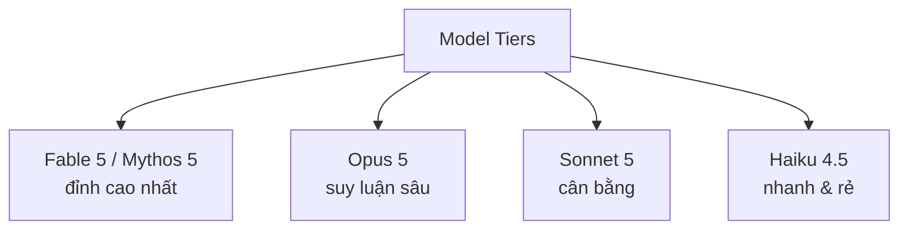
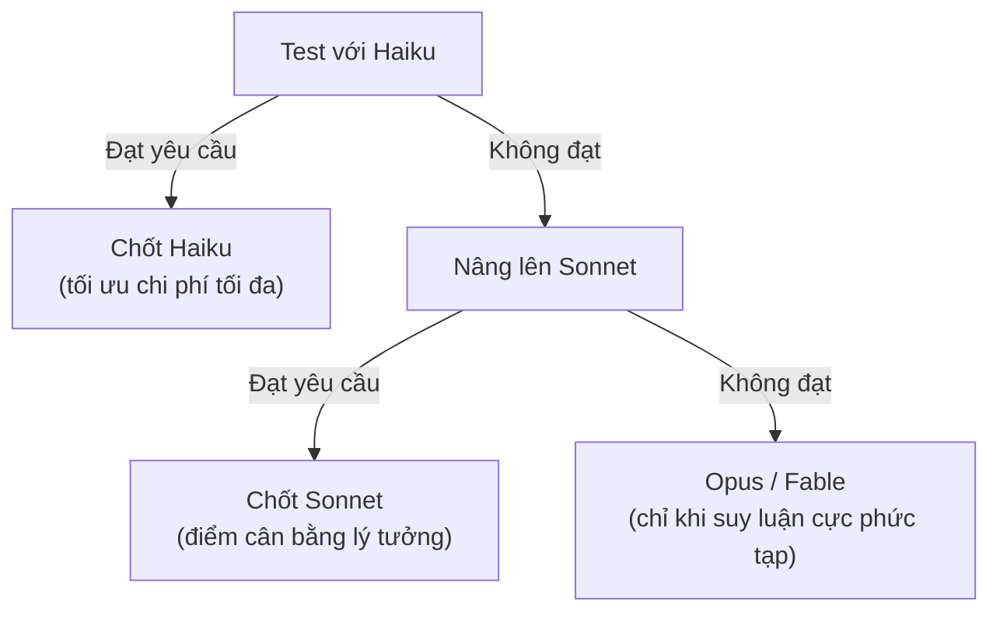
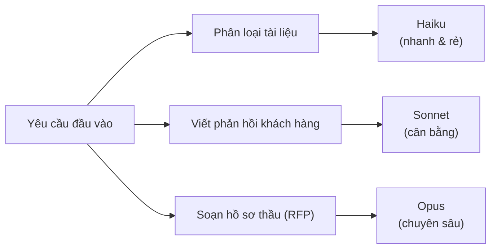

---
tags:
  - claude/nen-tang
aliases:
  - Model Tiers
  - Chọn Model
  - Phân cấp Model
up: "[[Claude Platform]]"
---

# Model Tiers (Chọn Model)

Khi gọi [[REST API]]/[[SDKs]], tham số `model` quyết định model nào xử lý request. Chọn sai gây đánh đổi hai chiều:

- **Model quá "khủng"** → chi phí/độ trễ cao không cần thiết cho việc đơn giản.
- **Model quá rẻ** → chất lượng đầu ra không đạt cho việc phức tạp.

## 4 cấp độ model (Anthropic, cập nhật ~06/2026)



| Cấp | Model ID | Ngữ cảnh | Giá Input/Output (1M token) | Dùng khi |
| --- | --- | --- | --- | --- |
| **Fable 5** (Mythos 5 dùng riêng cho Project Glasswing) | `claude-fable-5` | 1M | $10 / $50 | Việc khó nhất, agentic phức tạp, giá trị mang lại vượt xa chi phí. Thinking luôn bật, không tắt được. |
| **Opus 5** | `claude-opus-5` | 1M | $5 / $25 | Suy luận sâu, phân tích phức tạp, code nhiều bước. **Model mặc định khi không có yêu cầu khác** — không tự ý hạ cấp xuống Sonnet/Haiku để tiết kiệm chi phí. |
| **Sonnet 5** | `claude-sonnet-5` | 1M | $3 / $15 (giá intro $2/$10 đến 31/08/2026) | Điểm cân bằng chất lượng/tốc độ/giá — mặc định hợp lý cho hầu hết ứng dụng production. |
| **Haiku 4.5** | `claude-haiku-4-5` | 200K | $1 / $5 | Việc số lượng lớn, độ phức tạp thấp: phân loại, trích xuất, định tuyến request. |

- Model ID **không hardcode "mãi mãi"** — Anthropic release phiên bản mới theo thời gian (xem ví dụ ở [[TypeScript]]).
- Muốn tra ID model cũ hơn hoặc capability chi tiết (vision, thinking, effort...): dùng `GET /v1/models` (Models API) thay vì đoán.

## Điều chỉnh chi phí/chất lượng trong cùng một model

Ngoài chọn tier, còn 2 đòn bẩy khác:

- **`output_config.effort`** (`low` → `xhigh` → `max`) — điều chỉnh độ sâu suy luận (thinking) và token tiêu tốn mà **không đổi model**. `high` là mặc định, `xhigh` hợp nhất cho code/agentic phức tạp.
- **Batch API** (`/v1/messages/batches`) — xử lý bất đồng bộ, giảm **50% chi phí**, phù hợp việc không cần phản hồi tức thời (xử lý hàng loạt).
- **Prompt caching** — cache phần prompt ổn định (system prompt, tool list) để giảm chi phí input token lặp lại giữa các request.

## Quy trình đánh giá & chọn model (Model Evaluation)

Thay vì đoán tier phù hợp, nên đánh giá thực tế theo hướng **từ rẻ → đắt**:

1. **Dựng bộ eval nhỏ** — 20-30 mẫu dữ liệu thực tế đại diện cho tác vụ, kèm tiêu chuẩn rõ ràng thế nào là kết quả "đạt yêu cầu".
2. **Test bottom-up** — chạy bộ eval qua model rẻ nhất trước, chỉ nâng cấp khi không đạt:



- Không dừng ở model đầu tiên "có vẻ ổn" — luôn thử tier thấp hơn trước để tránh trả dư chi phí.
- Giữ nguyên bộ eval này để tái dùng khi migrate sang model mới sau này (so sánh chất lượng trước/sau) hoặc khi Anthropic release phiên bản kế tiếp.
- Ngoài chất lượng, cân nhắc thêm **độ trễ (latency)** — Haiku/Sonnet nhanh hơn Opus/Fable đáng kể, có thể là yếu tố quyết định với tác vụ real-time dù chất lượng model lớn hơn nhỉnh hơn.

### Benchmark bằng code

Cách đo nhanh: gọi cùng một `prompt`/`max_tokens`, chỉ đổi `model` qua từng vòng lặp, đọc `response.usage` (số token input/output — quyết định trực tiếp chi phí):

```python
for model in ["claude-haiku-4-5", "claude-sonnet-5", "claude-opus-5"]:
    response = client.messages.create(
        model=model, max_tokens=300,
        messages=[{"role": "user", "content": prompt}],
    )
    print(model, response.usage)
```

Ví dụ với tác vụ đơn giản (định nghĩa ngắn 2 câu): Opus trau chuốt nhưng chậm/thừa chất lượng, Sonnet cân bằng nhưng vẫn dư, Haiku (< 1s) đủ chính xác và rẻ nhất → chọn Haiku.

> **Nguyên tắc vàng:** model đúng là model **rẻ nhất** cho ra kết quả **đủ tốt** để đưa vào sản phẩm — không phải model thông minh nhất.

- Tác vụ đơn giản (định nghĩa, phân loại) → Haiku thường là quá đủ.
- Tác vụ phức tạp (báo cáo tuân thủ pháp lý, sửa lỗi hệ thống) → chạy đúng benchmark này, thực tế thường buộc phải lên Opus/Fable.

## Model Routing (định tuyến theo tác vụ)

Ứng dụng thực tế hiếm khi chỉ dùng 1 model cố định — nên **định tuyến từng loại tác vụ đến tier phù hợp** ngay trong cùng một hệ thống/endpoint, thay vì chọn 1 model chung cho tất cả:



- Mỗi loại tác vụ đã được benchmark riêng (xem [[#Benchmark bằng code]]) để chốt tier rẻ nhất đạt chuẩn cho chính nó — không suy luận "cả hệ thống dùng Opus cho chắc".
- Cách làm: thêm 1 bước phân loại/route nhẹ (rule-based hoặc model rẻ) trước khi gọi model xử lý chính, dựa trên loại tác vụ hoặc độ phức tạp đầu vào.

## Liên kết

- Thuộc nhóm: [[Claude Platform]]
- Xem thêm: [[REST API]] (tham số `model` trong ví dụ Messages API), [[SDKs]], [[TypeScript]]
- Chi tiết sâu (pricing đầy đủ, migration giữa các model, effort/thinking...): skill `claude-api` khi cần tra cứu.
