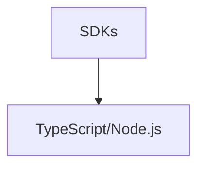

---
tags:
  - claude/nen-tang
aliases:
  - SDKs
  - Bộ công cụ phát triển
up: "[[Claude Platform]]"
---

# SDKs (Bộ công cụ phát triển)

Thư viện hỗ trợ sẵn cho các ngôn ngữ lập trình phổ biến (Python, TypeScript/JavaScript...), giúp gọi [[REST API]] nhanh và ít lỗi hơn so với tự viết HTTP request thủ công.

- Đóng gói sẵn: xử lý auth, retry, streaming response, định dạng request/response...
- Giảm boilerplate code so với gọi REST API trực tiếp.
- Có phiên bản riêng cho **Claude Agent SDK** — xây dựng agent tự động (không chỉ gọi chat đơn thuần).
- Tích hợp sẵn [[Tool Runner]] — tự động hóa vòng lặp gọi tool + tự sinh JSON Schema từ code, khỏi viết tay.

## Theo ngôn ngữ

- [[TypeScript]] — cài đặt, giải phẫu request, ví dụ thực hành (code review)

## Liên kết

- Thuộc nhóm: [[Claude Platform]]
- Xem thêm: [[REST API]], [[Console]]
