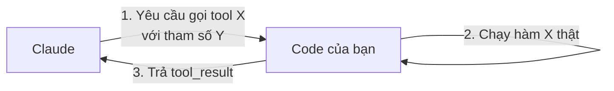
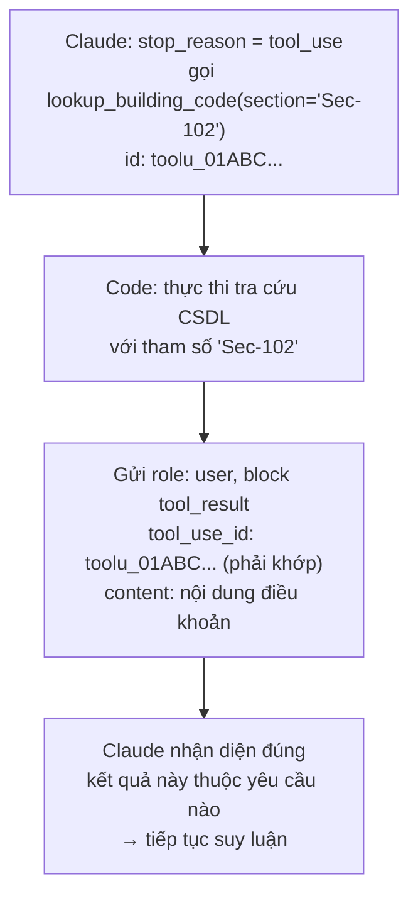

---
tags:
  - claude/nen-tang
aliases:
  - Tool Use
  - Function Calling
  - Sử dụng công cụ
up: "[[Claude Platform]]"
---

# Tool Use (Function Calling)

**Tool** là một hàm do lập trình viên tự viết (query CSDL, gọi API ngoài, đọc file...), được mô tả cho Claude qua tên + công dụng + tham số đầu vào. Claude tự phân tích ngữ cảnh và quyết định *khi nào* cần gọi tool nào — đây là cách Claude vượt qua giới hạn không tự truy cập được hệ thống dữ liệu nội bộ của bạn.

## Nguyên tắc cốt lõi

> **Claude KHÔNG trực tiếp chạy công cụ — code của bạn mới là nơi thực thi nó.**



Claude chỉ trả về một yêu cầu dạng JSON ("hãy chạy tool này với input này"); ứng dụng nhận yêu cầu, tự thực thi, rồi gửi kết quả ngược lại để Claude tiếp tục suy luận.

## Cấu trúc khai báo tool

Mỗi tool là một JSON Schema gồm 3 phần:

- **`name`** — tên định danh tool.
- **`description`** — mô tả công dụng, quan trọng nhất vì Claude dựa vào đây để quyết định *có nên* và *khi nào* gọi tool này (nên viết rõ ràng, cụ thể, như hướng dẫn cho người mới — không chỉ đặt tên hàm).
- **`input_schema`** — JSON Schema mô tả tham số đầu vào cần cung cấp.

```json
{
  "name": "lookup_building_code",
  "description": "Tra cứu nội dung một điều khoản quy chuẩn xây dựng theo mã định danh. Trả về toàn bộ văn bản của điều khoản đó.",
  "input_schema": {
    "type": "object",
    "properties": {
      "section": {
        "type": "string",
        "description": "Mã điều khoản quy chuẩn xây dựng cần tra cứu (ví dụ: 'Sec-102')"
      }
    },
    "required": ["section"]
  }
}
```

> **Nguyên nhân số 1 khiến Agent gọi sai tool (hoặc không nhận ra tool khả dụng): `description` quá mơ hồ.** Hãy mô tả cụ thể mục đích và dữ liệu trả về, không viết chung chung.

## Vòng đời một lượt gọi (tool_use_id)

1. Claude trả về `stop_reason: "tool_use"` kèm block `type: "tool_use"` gồm `id` (mã định danh riêng cho lượt gọi này, ví dụ `toolu_01ABC...`), `name`, `input`.
2. Code chạy hàm tương ứng với `input` đó.
3. Gửi lại block `type: "tool_result"` với `tool_use_id` **khớp chính xác** `id` ở bước 1, mang `content` là kết quả.



Nhờ `tool_use_id`, Claude biết chính xác `tool_result` vừa nhận thuộc về lượt gọi tool nào — quan trọng khi có nhiều tool được gọi song song (xem [[#Gọi song song parallel tool use]]) vì lúc đó nhiều `tool_result` có thể trả về không theo đúng thứ tự gọi.

Chi tiết cách nối `messages` qua nhiều lượt để tạo thành agent hoàn chỉnh: xem [[Vòng lặp Agent]].

## Các loại tool

- **Custom tools** — tự định nghĩa và tự thực thi trong code của bạn; phổ biến nhất.
- **Server-side/built-in tools** — Anthropic host & thực thi sẵn (web search, code execution, bash, text editor, computer use...): Claude gọi nhưng hạ tầng Anthropic chạy, không phải code của bạn.
- **MCP connectors** — tool lấy từ MCP server bên ngoài, xem [[Connectors (MCP)]].

## tool_choice — điều khiển việc chọn tool

- `auto` (mặc định) — Claude tự quyết có dùng tool hay trả lời trực tiếp.
- `any` — bắt buộc gọi một tool nào đó, không được trả lời trực tiếp.
- `tool: {name}` — ép dùng đúng một tool cụ thể.
- `none` — cấm dùng tool.

## Khai báo nhiều tool cùng lúc

Mảng `tools` không giới hạn ở 1 phần tử — khai báo càng nhiều tool, Claude càng có nhiều lựa chọn để tự đối chiếu với yêu cầu người dùng và quyết định *tool nào, theo thứ tự nào*, dựa hoàn toàn vào phần `description` của từng tool.

Cấu trúc [[Vòng lặp Agent|vòng lặp]] không đổi — chỉ cần mở rộng 2 chỗ: thêm khai báo JSON vào mảng `tools`, và thêm một nhánh vào hàm điều hướng thực thi (`runTool`/`run_tool`) để `switch`/rẽ nhánh theo `name`:

```javascript
function runTool(name, input) {
  switch (name) {
    case "get_weather":
      return getWeather(input.city);   // thời tiết hôm nay
    case "get_forecast":
      return getForecast(input.city);  // dự báo nhiều ngày tới
  }
}
```

Muốn thêm tool thứ 3? Chỉ cần thêm 1 khai báo JSON + 1 nhánh `case` mới — toàn bộ logic vòng lặp bên dưới giữ nguyên, không cần sửa.

**Ví dụ:** yêu cầu *"Chuẩn bị hành lý đi Denver 3 ngày"* — Claude tự nhận ra cần cả thời tiết hôm nay lẫn dự báo 3 ngày tới, nên gọi cả `get_weather` lẫn `get_forecast` rồi tổng hợp thành lời khuyên cụ thể (ví dụ: mặc nhiều lớp áo vì có tuyết nhẹ, sẽ ấm dần). Việc Claude nhận diện đúng cả 2 tool cần dùng phụ thuộc hoàn toàn vào `description` của mỗi tool có đủ rõ ràng hay không — một lần nữa khẳng định `description` là yếu tố quyết định độ chính xác của Agent.

## Gọi song song (parallel tool use)

Nếu nhiều tool độc lập nhau (như `get_weather` và `get_forecast` ở trên), Claude có thể trả về nhiều block `tool_use` trong cùng một response — giảm số vòng lặp cần thiết thay vì gọi tuần tự từng cái. Khi đó mỗi block mang `id` riêng, và từng `tool_result` gửi lại phải khớp đúng `tool_use_id` tương ứng (xem [[#Vòng đời một lượt gọi tool_use_id|phần tool_use_id]]).

## Xử lý lỗi

Khi tool thực thi lỗi, vẫn trả `tool_result` như bình thường nhưng đánh dấu `is_error: true` kèm mô tả lỗi, để Claude tự điều chỉnh (thử cách khác, hỏi lại người dùng) thay vì làm gãy luồng hội thoại.

## Tích hợp vào hệ thống thực tế (Production)

Không cần viết mã nguồn mới riêng cho AI — Tool thường chỉ là **lớp bọc mỏng (thin wrapper)** quanh các hàm/dịch vụ đã có sẵn trong ứng dụng (hàm truy vấn CSDL, gọi service nội bộ...).

Ví dụ: một **Compliance Agent** (kiểm định tuân thủ pháp lý) dùng thẳng các hàm `lookup_building_code`/`search_building_code` vốn đã tồn tại trong dự án — khi dùng [[Tool Runner]], chỉ cần truyền thẳng các hàm này vào là Agent tự tra cứu và dẫn chứng đúng điều khoản pháp lý.

## Recap

| Nội dung | Chi tiết cần nhớ |
| --- | --- |
| Bản chất của Tool | Cho Claude kết nối hệ thống bên ngoài: bạn định nghĩa hàm → Claude chọn khi nào gọi → code của bạn trực tiếp thực thi. |
| Cấu trúc Tool | JSON Schema gồm `name`, `description`, `input_schema`, truyền qua mảng `tools`. |
| Tầm quan trọng của `description` | Mô tả chung chung/mơ hồ là nguyên nhân chính khiến Agent gọi sai hoặc bỏ sót tool. |
| Dấu hiệu thực thi | `stop_reason: "tool_use"` → chạy hàm tương ứng → phản hồi bằng `tool_result` khớp đúng `tool_use_id`. |
| Tối ưu với [[Tool Runner]] | SDK (TypeScript, Python, Ruby) tự sinh Schema từ hàm code thật + tự quản lý toàn bộ vòng lặp. |
| Lựa chọn triển khai | Tự quản lý [[Vòng lặp Agent\|vòng lặp]], dùng [[Tool Runner]] của SDK, hoặc giao hẳn cho Managed Agents của Anthropic vận hành. |

## Liên kết

- Thuộc nhóm: [[Claude Platform]]
- Cơ chế lắp ráp nhiều lượt gọi tool thành hành vi agent: [[Vòng lặp Agent]]
- Kết nối tool từ server ngoài: [[Connectors (MCP)]]
- SDK tự sinh `input_schema` từ code, khỏi gõ tay: [[Tool Runner]]
