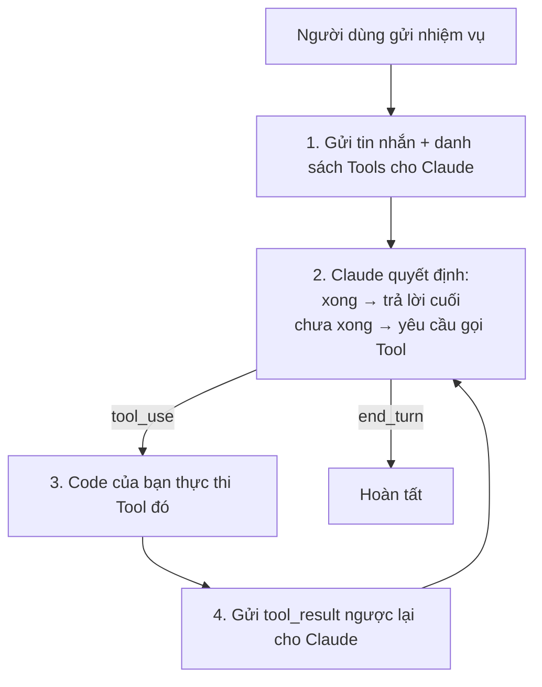
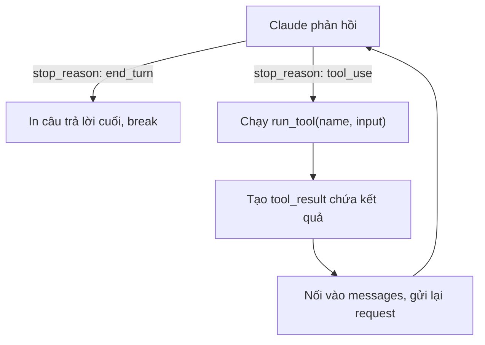
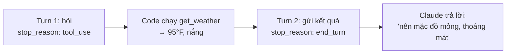

---
tags:
  - claude/nen-tang
aliases:
  - Agent Loop
  - Vòng lặp Agent
  - Agentic Loop
up: "[[Claude Platform]]"
---

# Vòng lặp Agent (Agent Loop)

Cơ chế biến Claude từ một mô hình hỏi-đáp đơn thuần (1 request → 1 response) thành một **Agent tự vận hành**: Claude tự đóng cả hai vai trong một vòng lặp nhắn tin, không cần con người can thiệp giữa chừng — tự phân tích việc cần làm, chọn tool, đọc kết quả, và lặp lại đến khi xong.

Đây chính là cách [[Tool Use (Function Calling)|Tool use]] (nhắc ở [[Claude Platform#Góc nhìn kiến trúc 3 tầng|Primitives]]) được lắp ráp thành hành vi agent thực sự.

## 5 bước

1. **Khởi tạo** — gửi yêu cầu người dùng kèm danh sách tool khả dụng.
2. **Claude ra quyết định** — trả về câu trả lời cuối cùng, **hoặc** một yêu cầu gọi tool (`tool_use`).
3. **Thực thi** — code của bạn (không phải Claude) chạy tool đó (query CSDL, chạy code, tìm web...).
4. **Phản hồi** — gửi lại kết quả tool (`tool_result`) cho Claude.
5. **Lặp lại** — quay về bước 2, cho đến khi `stop_reason` = `end_turn`.

## Điểm cần nhớ

- Claude **không tự chạy tool** — chỉ *yêu cầu* gọi tool qua `tool_use`; việc thực thi thật luôn nằm ở code của người phát triển.
- Vòng lặp có thể lặp nhiều vòng (nhiều lần gọi tool nối tiếp) trước khi đến `end_turn` — không giới hạn ở 1 lần gọi tool duy nhất.
- Đây là nền tảng của mọi hệ thống agent phức tạp hơn (Claude Code, Managed Agents...) — chỉ khác ở việc ai giữ vòng lặp (code tự viết vs. hạ tầng managed).

## Ví dụ thực hành (Python)

3 thành phần cốt lõi khi tự viết vòng lặp (ví dụ: agent tra cứu thời tiết):

1. **`tools`** — mảng JSON Schema mô tả công cụ Claude được phép dùng: `name`, `description` (để Claude biết *khi nào* nên dùng), `input_schema` (tham số đầu vào cần cung cấp).
2. **`run_tool(name, input)`** — hàm phía ứng dụng, chạy khi Claude yêu cầu (ví dụ: gọi API thời tiết thật, thay vì trả kết quả giả lập).
3. **Vòng lặp `while True`** — rẽ nhánh theo `stop_reason`:

**Điểm kỹ thuật quan trọng** — khi gặp `tool_use`, phải nối thêm **2 tin nhắn** vào `messages` trước lượt gọi tiếp theo, nếu không Claude sẽ mất ngữ cảnh đã gọi tool gì:

- `role: "assistant"` — toàn bộ `response.content` gốc (gồm cả khối `tool_use` Claude vừa trả về).
- `role: "user"` — khối `tool_result`, tham chiếu đúng `tool_use_id`, mang kết quả thực thi.

Nhờ giữ lại lịch sử này, vòng lặp sau Claude mới biết tool đã trả về gì để tổng hợp câu trả lời cuối cho người dùng.

### Vết chạy thực tế: chỉ 2 turn là xong

Với câu hỏi *"Tôi nên mặc gì ở Austin hôm nay?"*, toàn bộ vòng lặp chỉ tốn **2 lượt gọi API, 1 lần thực thi tool**:

- **Turn 1** — Claude không biết thời tiết thực tế → phát `tool_use` gọi `get_weather({"city": "Austin"})`; code thực thi và lấy được `95°F, nắng`.
- **Turn 2** — gửi kết quả đó lại; Claude phân tích (95°F ≈ 35°C, nắng) và đưa ra lời khuyên trang phục, `stop_reason` = `end_turn`.

**Core Pattern:** mọi agent phức tạp hơn (tự sửa code, tìm web, truy vấn CSDL...) đều chạy trên đúng nguyên lý lặp này — chỉ khác về số turn và loại tool được gọi.

## Từ demo đến Production

Kiến trúc vòng lặp **giữ nguyên 100%** khi lên production (ví dụ: một Compliance Agent kiểm định tuân thủ pháp lý) — chỉ khác ở việc tool và hạ tầng nối vào hệ thống thật thay vì giả lập:

| | Demo (thời tiết) | Production (Compliance Agent) |
| --- | --- | --- |
| Tool | Giả lập `get_weather` | Gọi API CSDL mã quy chuẩn xây dựng thật |
| Kết quả | In ra console | Trả real-time (streaming SSE) |
| Kết thúc | Thoát script | Lưu rủi ro phát hiện được vào bảng CSDL |

## Recap

- **Agent = Claude trong vòng lặp** Quan sát → Ra quyết định → Hành động → Lặp lại.
- **Cơ chế:** gửi tin nhắn kèm tools → chạy tool khi được yêu cầu → trả `tool_result` → dừng khi `stop_reason == "end_turn"`.
- **Phân chia vai trò:** bạn làm chủ vòng lặp + tools; Claude làm chủ reasoning (suy luận khi nào cần tool, diễn giải kết quả).
- **Mở rộng:** cùng một mẫu áp dụng từ demo nhỏ đến hệ thống tự động hóa quy mô lớn.
- **Không muốn tự viết vòng lặp bằng tay?** Hai mức tự động hóa: [[Tool Runner]] (vẫn chạy trong code của bạn, SDK tự lo boilerplate + sinh schema) và **Managed Agents** (Anthropic tự vận hành toàn bộ vòng lặp trên hạ tầng của họ — xem mục Managed Agents trong [[Claude Platform]]).

## Liên kết

- Thuộc nhóm: [[Claude Platform]]
- Khái niệm nền tảng (định nghĩa tool, cấu trúc khai báo, tool_choice...): [[Tool Use (Function Calling)]]
- SDK tự động hóa toàn bộ vòng lặp này: [[Tool Runner]]
- Cơ chế bên dưới: `response.content` có thể chứa block `tool_use` — xem ví dụ đọc block trong [[TypeScript]]
- Ví dụ hạ tầng giữ vòng lặp thay code tự viết: nhắc ở mục Managed Agents trong [[Claude Platform]]
- Ứng dụng thực tế: [[Claude Code]] (CLI agent), [[Hooks]] (can thiệp vào vòng lặp)
