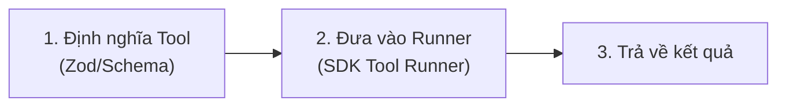

---
tags:
  - claude/nen-tang
aliases:
  - Weather Agent
  - Tool Runner Ví dụ thực hành
up: "[[Tool Runner]]"
---

# Weather Agent (Ví dụ thực hành)

Bài tập minh hoạ cách dùng [[Claude Code]] như lập trình viên phụ để hoàn thiện nhanh code tích hợp [[Tool Runner]] từ một **tệp khung (stub file)** có sẵn, thay vì tự gõ code SDK thủ công.

## Ý tưởng chính

Thay vì tự viết từng dòng lệnh gọi SDK, giao tệp khung (stub) cho Claude Code và yêu cầu nó hoàn thiện phần logic dựa trên các thành phần cơ bản (primitives) đã học — ở đây là [[Tool Runner]].

## Cấu trúc dự án mẫu

Một tệp TypeScript lấy thông tin thời tiết, ban đầu chỉ có 2 hàm khung (stub) rỗng:

| Hàm (Stub) | Nhiệm vụ |
| --- | --- |
| `getWeather(city)` | Định nghĩa tool thực tế (local tool) — xử lý logic lấy nhiệt độ & điều kiện thời tiết theo tên thành phố truyền vào. |
| `run()` | Kích hoạt [[TypeScript\|Claude TypeScript SDK]], dùng [[Tool Runner]] để quản lý vòng lặp gọi tool tự động. |

Claude Code đóng vai trò lập trình viên — tự điền code hoàn chỉnh vào 2 hàm trên theo yêu cầu.

## Vì sao cần Tool Runner ở đây

- **Cách làm thủ công** — tự viết vòng lặp: gửi request → nhận phản hồi chứa `tool_use` → tự gọi hàm local → gửi `tool_result` lại cho Claude (xem [[Vòng lặp Agent]]).
- **Tool Runner giải quyết** — tự động hoá toàn bộ vòng lặp gọi tool và xử lý dữ liệu trung gian, không cần tự kết nối (wire up) thủ công — xem cơ chế chi tiết ở [[Tool Runner]].

## Kích hoạt Claude API Skill

Để [[Claude Code]] hiểu đúng cấu trúc, cú pháp và quy tắc mới nhất của Claude TypeScript SDK khi hoàn thiện stub file, cần bật **skill tích hợp sẵn `claude-api`** (khác [[Skills|Skill]] cấp API dùng qua `container.skills` — đây là skill riêng của Claude Code CLI):

- **Kích hoạt** — gọi trực tiếp bằng lệnh `/claude-api`, hoặc Claude Code tự nhận diện và bật skill này khi phát hiện dự án đang dùng TypeScript SDK của Anthropic.
- **Cài đặt nếu thiếu** — thêm plugin từ marketplace: `/plugin marketplace add AnthropicsSkills` (chú ý chữ `s` ở cuối `Anthropics`).

## Cấu trúc prompt 3 yếu tố

Để Claude Code sinh code chạy đúng ngay lần thử đầu tiên, prompt cần nêu rõ 3 yếu tố:

1. **Tên file cần sửa** — ví dụ `weather.ts`.
2. **Mô hình/pattern cần dùng** — ví dụ *sử dụng SDK Tool Runner*.
3. **Trạng thái đầu ra mong muốn** — ví dụ *hoàn thiện hàm `getWeather`, hàm `run` và tự động chạy thử*.

## Quy trình tự động hoàn thiện (Self-healing)

Sau khi nhận prompt, Claude Code tự thực hiện chuỗi hành động — thể hiện rõ cơ chế **tự sửa lỗi (self-correction)** đã mô tả ở [[Claude Code#Cơ chế hoạt động Vòng lặp Agentic|vòng lặp Agentic]]:

1. **Viết code** — hoàn thiện logic cho `getWeather` và `run` đúng theo kiểu dữ liệu (TypeScript types) đã khai báo trong stub.
2. **Thêm lệnh thực thi** — chèn đoạn gọi hàm ở cuối file để chạy thử.
3. **Tự kiểm thử & sửa lỗi** — chạy trực tiếp script trong terminal; nếu lỗi, tự đọc error message và sửa lại mã nguồn ngay tại chỗ, lặp lại đến khi chương trình chạy thành công.

| Thành phần | Vai trò |
| --- | --- |
| `/claude-api` | Skill cung cấp tri thức chuẩn về Claude SDK cho Claude Code. |
| Prompt 3 yếu tố | Định hướng chính xác: tên file + pattern áp dụng + kết quả mong muốn. |
| Vòng lặp self-healing | Tự chạy code → tự đọc lỗi → tự sửa code đến khi hoàn chỉnh. |

## Kết quả Claude Code sinh ra

Trong lượt chạy thử, Claude Code tự hoàn thành trọn vẹn phần lập trình:

- **Tool bằng Zod** — tự định nghĩa tool cho `getWeather` bằng thư viện **Zod** để validate/ép kiểu (schema parsing) tham số `city` đầu vào, sau đó trả về thông tin thời tiết đúng kiểu dữ liệu đã khai báo.
- **Khởi tạo Tool Runner & hàm `run`** — tự viết phần logic điều khiển vòng lặp gọi tool (`runner`) đúng theo yêu cầu, không cần can thiệp thủ công.
- **Thực thi & in kết quả** — tự chạy script, in kết quả cuối cùng của Agent Loop ra terminal.

## Mô hình lập trình cần nhớ (The Pattern to Remember)

Phần lớn code làm việc với Claude API (đặc biệt qua SDK) đều theo cấu trúc 3 bước cố định:

**Workflow khuyến nghị** — không cần tự gõ tay từng dòng code này:

1. Tạo tệp khung đơn giản (**stub it**).
2. Giao tệp cho Claude Code kèm prompt định hướng (**delegate it**).
3. Chỉ cần xem và duyệt thay đổi mã nguồn (**review the diff**).

## Recap

| Nội dung | Chi tiết cần nhớ |
| --- | --- |
| Bản chất Claude Code | AI Agent chạy trực tiếp trong terminal, có khả năng chỉnh sửa file & chạy lệnh hệ thống — xem [[Claude Code]]. |
| Claude API Skill | Tự nạp khi nhận diện TypeScript SDK, hoặc kích hoạt thủ công bằng `/claude-api`. |
| Công thức prompt hiệu quả | Tên file + Pattern áp dụng + Trạng thái mong muốn. |
| Tư duy lập trình hiện đại | Định nghĩa Tool → đưa cho Runner → nhận kết quả — *stub it, delegate it, review the diff*. |

## Liên kết

- Ví dụ minh hoạ cho: [[Tool Runner]]
- Công cụ hoàn thiện code: [[Claude Code]]
- Cơ chế thủ công được thay thế: [[Vòng lặp Agent]]
- Ngôn ngữ dùng trong ví dụ: [[TypeScript]]
- Phân biệt với khái niệm Skill cấp API (`container.skills`): [[Skills]]
