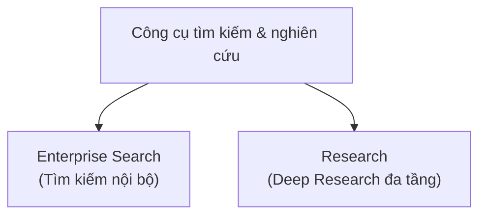

---
tags:
  - claude/nhom
aliases:
  - Công cụ tìm kiếm & nghiên cứu
up: "[[Claude Ecosystem]]"
---

# Công cụ tìm kiếm & nghiên cứu

Nhóm các tính năng phục vụ tìm kiếm và nghiên cứu thông tin.

- [[Enterprise Search]] — Tìm kiếm nội bộ
- [[Research]] — Deep Research đa tầng

## Liên kết

- Thuộc: [[Claude Ecosystem]]
