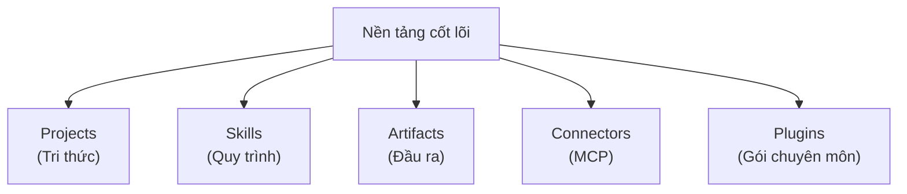

---
tags:
  - claude/nhom
aliases:
  - Nền tảng cốt lõi
  - Workspace & Data
up: "[[Claude Ecosystem]]"
---

# Nền tảng cốt lõi (Workspace & Data)

Nhóm các thành phần nền tảng phục vụ tổ chức không gian làm việc và dữ liệu của Claude.

- [[Projects]] — Tri thức
- [[Skills]] — Quy trình
- [[Artifacts]] — Đầu ra
- [[Connectors (MCP)]]
- [[Plugins]] — Gói chuyên môn (Skills + Connectors + Subagents)

## Liên kết

- Thuộc: [[Claude Ecosystem]]
