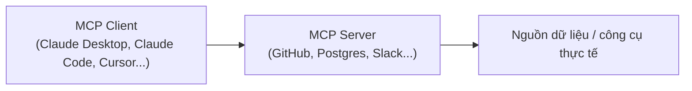

---
tags:
  - claude/nen-tang
aliases:
  - Connectors
  - MCP
up: "[[Nền tảng cốt lõi]]"
---

# Connectors (MCP)

**Model Context Protocol (MCP)** là tiêu chuẩn mở do Anthropic phát triển — ví như "cổng USB-C cho AI": một giao thức chung để AI truy cập an toàn vào dữ liệu và công cụ bên ngoài, thay vì mỗi ứng dụng phải tự viết tích hợp riêng lẻ.

- Ví dụ: Google Drive, Notion, GitHub, Slack, Postgres, hệ thống nội bộ doanh nghiệp...
- Cho phép Claude đọc/thao tác dữ liệu thực tế của người dùng thay vì chỉ trả lời dựa trên kiến thức tĩnh.
- Là nền tảng để các tiện ích tích hợp khác (Slack, Excel, Word...) hoạt động được.

## Vì sao cần MCP, đã có [[Tool Use (Function Calling)|Tool]] và [[Skills]] rồi?

Nhìn thoáng qua, MCP giống như một lớp API chồng lên API sẵn có. Khác biệt nằm ở **ai là người bảo trì đoạn code tích hợp**:

- **Tự viết Custom Tool** cho từng dịch vụ (Asana, Google Calendar, Slack...): viết được, nhưng phải tự bảo trì mãi mãi — mỗi khi dịch vụ đó đổi API, bạn phải tự sửa lại wrapper của mình.
- **MCP**: chuyển gánh nặng bảo trì đó sang cho chính nhà cung cấp dịch vụ. Asana/Slack/Google... tự publish MCP Server của họ (tool + schema + auth đi kèm) theo giao thức chuẩn — khi họ đổi API, họ tự cập nhật server, phía mình không cần sửa gì.

### Ba khái niệm dễ nhầm: Tool vs [[Skills|Skill]] vs MCP

| | [[Tool Use (Function Calling)\|Tool]] | [[Skills\|Skill]] | MCP |
| --- | --- | --- | --- |
| Kết nối tới | Hệ thống **nội bộ của bạn** (CSDL, project tracker, API riêng) | Không phải tích hợp — là **quy trình/hướng dẫn** | Dịch vụ **của bên thứ ba** |
| Ai bảo trì | Bạn — bạn viết nên bạn tự sửa khi API đổi | Bạn (chỉ là cập nhật hướng dẫn, không phải code tích hợp) | Nhà cung cấp dịch vụ (Asana tự viết và tự bảo trì MCP Server của Asana) |

> Ghi nhớ: **Tool** là cho đồ của bạn, **Skill** là cho quy trình của bạn, **MCP** là cho đồ của người khác.

## Cách hoạt động

Mô hình Client - Server:

- **MCP Client**: ứng dụng AI đang dùng.
- **MCP Server**: chương trình trung gian kết nối AI với nguồn dữ liệu/công cụ cụ thể.

Ví dụ: thay vì tự export CSV từ Postgres rồi tải lên chatbox, kết nối một Postgres MCP Server → hỏi trực tiếp ("5 khách hàng mua nhiều nhất tháng này") → Claude tự nhận biết cần dùng tool, truy vấn qua MCP Server và tổng hợp kết quả.

## MCP biến AI thành Agent

- **AI truyền thống (text-only)**: chỉ nhận và trả lời bằng văn bản, dựa trên dữ liệu đã học sẵn — chỉ "nói".
- **AI Agent (Claude Code + MCP)**: tự thực hiện hành động thật (đọc file, chạy lệnh, truy vấn DB, gửi tin nhắn...) để hoàn thành nhiệm vụ, không chỉ trả lời.

## Ứng dụng thực tế

- **Project management**: MCP Server cho Linear/Jira → AI đọc code, tự tạo task và gán cho team.
- **Live documentation**: MCP Server cho Context7/tài liệu thư viện → AI lấy tài liệu mới nhất (React, Next.js, SDK...) thay vì dựa vào kiến thức cũ, tránh dùng hàm deprecated.
- **Database & hạ tầng**: MCP Server cho PostgreSQL/AWS/GitHub → AI truy vấn DB, tự review Pull Request trên GitHub.
- **Công cụ làm việc cá nhân/doanh nghiệp**: MCP Server cho Slack/Notion/Google Drive → AI tóm tắt thảo luận, tìm tài liệu, ghi chú tiến độ mà không cần chuyển app.

## Giá trị cốt lõi

- **Tiết kiệm công sức tích hợp**: viết 1 MCP Server cho dịch vụ → mọi AI Client tương thích MCP dùng ngay, không cần viết lại cho từng ứng dụng.
- **Mở rộng ngữ cảnh (context)**: AI không giới hạn ở dữ liệu tĩnh/đoạn code hiện tại, mà "với tới" dữ liệu thời gian thực từ công cụ làm việc hàng ngày.
- **An toàn & kiểm soát**: dữ liệu vẫn nằm trong máy/hệ thống của người dùng; AI chỉ tương tác qua các quyền hạn (prompts/tools/resources) mà MCP Server cho phép chia sẻ.

## Liên kết

- Thuộc nhóm: [[Nền tảng cốt lõi]]
- Xem thêm: [[Projects]], [[Skills]], [[Artifacts]]
- Liên quan tới: [[Bộ tiện ích tích hợp]]
- Ứng dụng thực tế trong Claude Code (lệnh, phân loại, scope): [[Quản lý MCP Server trong Claude Code]]
- Chi tiết kỹ thuật gọi qua Messages API (`mcp_servers`, `mcp_toolset`, introspection): [[MCP Connector (API)]]
