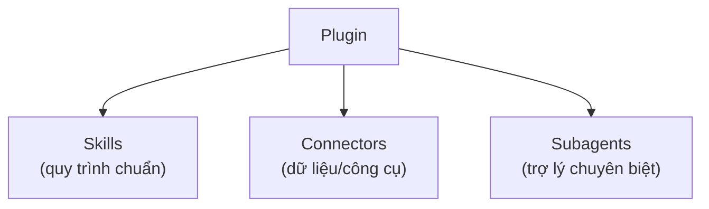
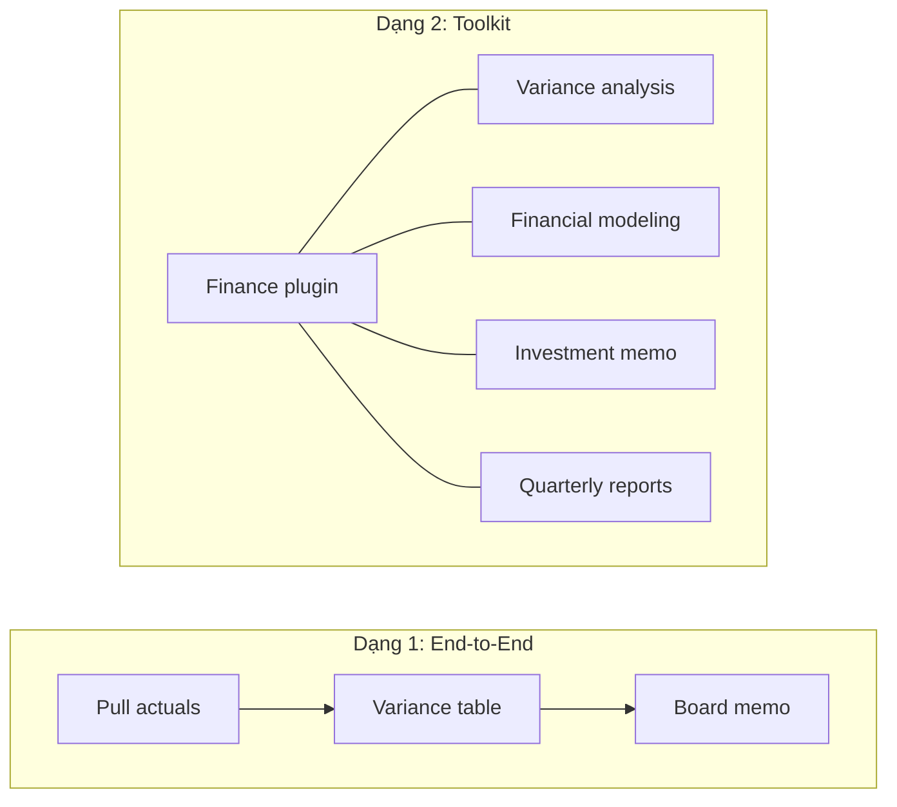

---
tags:
  - claude/nen-tang
aliases:
  - Plugins
  - Plugin
  - Gói chuyên môn
up: "[[Nền tảng cốt lõi]]"
---

# Plugins (Gói chuyên môn)

**Plugin** là một **bộ công cụ đóng gói sẵn** để biến quy trình làm việc từ "bí kíp cá nhân" thành thứ cả đội dùng chung: gom [[Skills]], [[Connectors (MCP)|Connectors]] và [[Subagents (Tác vụ phụ)|Subagents]] của một vị trí công việc vào một gói cài đặt duy nhất.

- **Chuyên môn đi theo bản cài đặt, không phụ thuộc cá nhân:** ai cài plugin (tài chính, pháp lý...) thì Claude của người đó nắm ngay quy trình phân tích cổ phiếu, quy chuẩn duyệt hợp đồng của team — không cần đào tạo lại từng người mới.
- Biến Claude từ *generalist* thành *specialist* cho một vai trò/ngành cụ thể.

## Plugin khác Skill ở đâu

| | [[Skills\|Skill]] | Plugin |
| --- | --- | --- |
| Phạm vi | **Một** quy trình cho một công việc đơn lẻ | **Cả bộ** phục vụ một vị trí công việc |
| Thành phần | `SKILL.md` (+ assets/references/scripts) | Nhiều Skills + Connectors + Subagents |
| Đơn vị chia sẻ | Một thư mục Skill | Một gói cài đặt (install) |

> Ghi nhớ: Skill = *một kỹ năng*, Plugin = *cả bộ đồ nghề của một vai trò*.

## 2 dạng cấu trúc phổ biến của Plugin

Tùy mục đích của team, plugin thường có một trong hai "dạng" (shape/flavor):

| | Dạng 1: Quy trình khép kín (End-to-End) | Dạng 2: Bộ công cụ các Skill hay dùng (Toolkit) |
| --- | --- | --- |
| Dành cho | Công việc phức tạp gồm **nhiều bước nối tiếp theo thứ tự** | Các việc **độc lập nhưng lặp lại thường xuyên** của một phòng ban |
| Quan hệ giữa các Skill | **Phụ thuộc, tuần tự** — đầu ra bước trước là đầu vào bước sau | **Độc lập** — mỗi Skill dùng riêng, không cần thứ tự |
| Cách dùng | Chạy trọn quy trình như một luồng duy nhất | Gọi Skill nào cần, lúc nào cần |
| Ví dụ | `monthly-close`: pull actuals → variance table → board memo | Finance plugin: variance analysis, financial modeling, investment memo, quarterly reports |
| Lợi ích | Ai cài cũng làm đúng từng bước tiêu chuẩn, không lệch | Nhân sự mới cài **một lần** là có ngay trọn bộ đồ nghề chuẩn của team |

- **Cách chọn dạng:** hỏi "các việc này có bắt buộc theo thứ tự và bước sau cần kết quả bước trước không?" — có → dạng 1; không, chỉ là công việc thường gặp của cùng một team → dạng 2.
- **Có thể kết hợp:** một plugin theo vai trò (dạng 2) có thể chứa thêm một quy trình end-to-end (dạng 1) — ví dụ Finance plugin vừa có các skill lẻ vừa có luồng `monthly-close`.
- **Dạng 1 hợp với Subagent:** mỗi bước/công đoạn có thể giao cho một [[Subagents (Tác vụ phụ)|Subagent]] riêng (thu thập → phân tích → soạn thảo), giữ context từng bước gọn.
- **Dạng 2 dựa vào `description`:** vì các Skill độc lập, Claude chọn Skill phù hợp qua phần mô tả (cơ chế [[Skills#Lazy loading — tối ưu context window|lazy loading]]) — nên viết mô tả rõ, khác biệt giữa các Skill để tránh kích hoạt nhầm.
- **Nguyên tắc chung:** đóng gói vừa đủ theo một vai trò/luồng việc; plugin nhồi quá nhiều Skill không liên quan sẽ khó dùng và tốn context.

### Ví dụ minh họa: Legal plugin (dạng Toolkit)

Trong danh mục plugin, hai dạng được gắn nhãn rõ để phân biệt: **Legal** = *Function's toolkit* (gom việc pháp lý hay dùng), **Experiment Readout** = *End-to-end pipeline* (luồng phân tích thử nghiệm từ đầu đến cuối). Legal plugin do Anthropic phát hành, lấy từ **Marketplace** (Anthropic và đối tác), mô tả: các việc soát xét/xử lý hợp đồng mà đội pháp lý làm thường xuyên nhất. Gồm 5 Skill độc lập, gọi nhanh bằng slash command:

| Lệnh | Việc làm | Ghi nhớ |
| --- | --- | --- |
| `/nda-review` | Đánh dấu và redline NDA theo **house playbook** của công ty | Playbook = bộ lập trường/tiêu chuẩn của team |
| `/contract-summary` | Trích điều khoản then chốt, thời hạn quan trọng, nghĩa vụ từ bất kỳ hợp đồng nào | Đọc nhanh hợp đồng lạ |
| `/clause-library` | Tìm câu chữ dự phòng (**fallback language**) đã được duyệt cho từng tình huống | Tra cứu, không tự bịa điều khoản |
| `/regulatory-check` | Phát hiện rủi ro pháp lý theo **từng thẩm quyền/khu vực** trong bản thảo | Phụ thuộc jurisdiction |
| `/counterparty-research` | Tra hồ sơ công khai và lịch sử giao dịch của đối tác | Cần nguồn dữ liệu ngoài (Connectors) |

- **Không có thứ tự bắt buộc:** tùy tình huống gõ đúng lệnh cần dùng — đây chính là đặc trưng dạng Toolkit (khác `monthly-close` ở trên, phải chạy tuần tự).
- **Cần tùy biến trước khi dùng thật:** bản có sẵn chỉ là khung chung; giá trị nằm ở việc thay bằng **playbook NDA, thư viện điều khoản đã duyệt** của chính công ty (hướng *customize* ở mục trên) — nếu không, `/nda-review` và `/clause-library` chỉ dựa trên chuẩn chung.
- **Skill kéo theo Connectors:** những Skill như `/counterparty-research` hay `/clause-library` chỉ phát huy khi có nguồn dữ liệu (kho tài liệu, hệ thống quản lý hợp đồng...) — đây là lý do plugin gom cả [[Connectors (MCP)|Connectors]] chứ không chỉ Skill.
- **Tên lệnh & namespace:** slash command của plugin có thể hiển thị kèm tiền tố plugin (`plugin:skill`) khi trùng tên với Skill khác (xem [[Skills#Skill trong Claude Code (CLI)|Skill trong Claude Code]]).
- **Lưu ý nghiệp vụ:** kết quả pháp lý là bản **hỗ trợ soát xét**, luật sư/pháp chế vẫn phải kiểm tra và chịu trách nhiệm cuối cùng — nhất là `/regulatory-check` vì luật thay đổi theo khu vực và theo thời gian.

## Subagent trong Plugin

**Subagent** là trợ lý chuyên biệt đảm nhận riêng một công đoạn của quy trình tổng thể, chạy trong **context riêng** rồi chỉ trả về kết quả tóm tắt (chi tiết cơ chế: [[Subagents (Tác vụ phụ)]]).

- Ví dụ: quy trình lớn kích hoạt **Research Subagent** để thu thập dữ liệu, rồi **Drafting Subagent** để soạn thảo văn bản.
- Đưa Subagent vào Plugin giúp việc phân vai (nghiên cứu → soạn thảo → kiểm tra...) được chuẩn hóa sẵn, không phải dựng lại ở mỗi máy.

## Plugin có sẵn từ Anthropic

Anthropic phát hành plugin theo các vai trò phổ biến: Tài chính, Pháp lý, Bán hàng (Sales), Marketing, Chăm sóc khách hàng (Customer Support), Quản lý sản phẩm (Product Management)...

Ba hướng sử dụng:

1. **Dùng ngay (off the shelf)** — cài bản tiêu chuẩn và dùng luôn.
2. **Tùy biến (customize)** — chỉnh plugin có sẵn theo quy trình/quy chuẩn riêng của team.
3. **Tự xây dựng (build your own)** — đóng gói plugin mới từ đầu cho nhu cầu nội bộ (chi tiết: [[Tự xây dựng Plugin (Cowork)]]).

## Cài đặt & tùy biến trong Cowork

Trong Cowork: **Customize → Plugins** → tìm plugin → **Install** → phê duyệt Connectors → Skill dùng được ngay. Muốn khớp quy trình riêng: chọn plugin đã cài → **Customize** → Cowork mở một tác vụ mới để bạn đưa tài liệu mẫu, Claude tự cập nhật các Skill. Chi tiết và mẹo: [[Cài đặt & Tùy biến Plugins (Cowork)]]. Chưa biết chọn plugin nào → gõ `/setup-claude` để Claude phỏng vấn ngắn và đề xuất; không có plugin khớp → tự tạo, xem [[Tự xây dựng Plugin (Cowork)]].

## Plugin trong Claude Code

Ngoài bộ chuyên môn theo vai trò, plugin ở [[Claude Code]] là cơ chế **phân phối tiện ích mở rộng**, có thể gom thêm:

- **Skills** (`skills/`), **slash commands** (`commands/`), **Subagents** (`agents/`), **[[Hooks]]** (`hooks/`) và cấu hình **MCP server** (`.mcp.json`).
- **Manifest** `.claude-plugin/plugin.json` — khai báo tên, phiên bản, mô tả của plugin.
- **Marketplace** — kho/danh mục plugin (thường là một repo Git). Thêm kho bằng `/plugin marketplace add <nguồn>`, cài plugin bằng `/plugin install <tên>@<marketplace>`.
- **Namespace:** Skill của plugin gọi dưới dạng `plugin:skill`, tránh trùng tên với skill khác (xem [[Skills#Skill trong Claude Code (CLI)|Skill trong Claude Code]]).

## Khi nào nên đóng gói thành Plugin

Đi theo lộ trình tích lũy: Global instructions → Projects → Skills → **Plugins** — chỉ đóng gói khi quy trình **đã chuẩn hóa** và cần **chia sẻ cho cả team** (xem [[Tích lũy Giá trị theo Thời gian (Compounding Value)]]). Với việc chỉ mình bạn dùng, một Skill riêng là đủ. Quy tắc ngón tay cái: bắt đầu từ **1 skill** cho việc lặp nhiều nhất, khi có khoảng **3–4 skills + connectors quan trọng** thì đã đáng đóng thành plugin chia sẻ cho team.

## Lưu ý

- Plugin gom cả Connectors, Hooks, script nên có thể **truy cập dữ liệu và chạy lệnh** — chỉ cài từ nguồn tin cậy, kiểm tra nội dung trước khi cài.
- Cập nhật plugin ở một nơi thì cả team hưởng bản mới — nên quản lý phiên bản rõ ràng (`version` trong manifest).

## Recap

| Nội dung | Chi tiết cần nhớ |
| --- | --- |
| Bản chất | Gói đóng gói sẵn Skills + Connectors + Subagents cho một vai trò — chia sẻ chuyên môn qua cài đặt |
| Khác Skill | Skill = một quy trình đơn lẻ; Plugin = cả bộ cho một vị trí công việc |
| 2 dạng cấu trúc | End-to-End (các Skill nối tiếp theo thứ tự, vd `monthly-close`) vs Toolkit (các Skill độc lập hay dùng của một team, vd Finance plugin) |
| Ví dụ Toolkit | Legal plugin: `/nda-review`, `/contract-summary`, `/clause-library`, `/regulatory-check`, `/counterparty-research` — gọi độc lập, cần tùy biến playbook/thư viện điều khoản của công ty |
| Subagent | Trợ lý phụ, context riêng, đảm nhận một công đoạn (Research → Drafting) |
| Nguồn | Có sẵn từ Anthropic theo vai trò (Finance, Legal, Sales, Marketing, Support, PM...) |
| 3 cách dùng | Off the shelf → Customize → Build your own |
| Claude Code | Manifest `.claude-plugin/plugin.json`, marketplace, `/plugin install`, namespace `plugin:skill` |
| Khi nào dùng | Quy trình đã chuẩn hóa và cần chia sẻ cho cả team |

## Liên kết

- Thuộc nhóm: [[Nền tảng cốt lõi]]
- Thành phần bên trong: [[Skills]], [[Connectors (MCP)]], [[Subagents (Tác vụ phụ)]]
- Xem thêm: [[Cài đặt & Tùy biến Plugins (Cowork)]], [[Hooks]], [[Claude Code]], [[Claude Cowork]], [[Tích lũy Giá trị theo Thời gian (Compounding Value)]]
