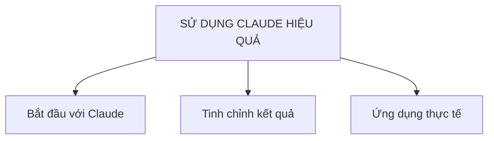

---
tags:
  - claude
  - ai
  - moc
aliases:
  - Sử dụng Claude hiệu quả
  - What You've Learned
  - Kỹ năng dùng Claude
---

# Sử dụng Claude hiệu quả

Ghi chú tổng (MOC — Map of Content) đúc kết các nguyên tắc và kỹ năng nền tảng khi làm việc với Claude. Khác với [[Claude Ecosystem]] (bản đồ các *công cụ/sản phẩm*), note này tập trung vào *cách sử dụng* Claude hiệu quả: từ hiểu bản chất, đến cải thiện kết quả qua từng lượt trò chuyện, đến áp dụng vào công việc thực tế.

## Sơ đồ gốc

## Ba nhánh chính

- [[Bắt đầu với Claude]]
- [[Tinh chỉnh kết quả]]
- [[Ứng dụng thực tế]]

## Liên kết

- Xem thêm về các công cụ cụ thể: [[Claude Ecosystem]]
